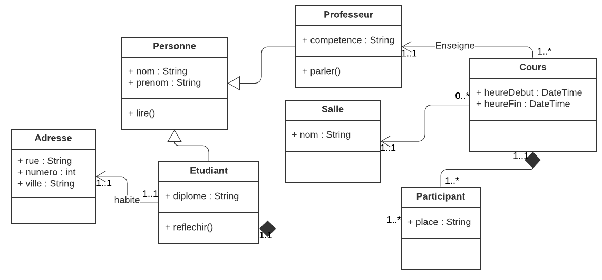

Une traduction du diagramme des classes en code Java.


```java
public class Personne {
    String nom;
    String prenom;

    public Personne(String nom, String prenom) {
        this.nom = nom;
        this.prenom = prenom;
    }

    void lire() {
        System.out.println(this.nom + " lit");
    }
}
```

```java
/**
 * Professeur hérite de Personne
 */
public class Professeur extends Personne{

    //propriété spécifique au professeur
    String competence;

    /**
     * constructeur avec tous les attributs, dont ceux de Personne
     * @param nom
     * @param prenom
     * @param competence
     */
    public Professeur(String nom, String prenom, String competence) {
        super(nom, prenom);  //appel du contructeur Personne
        this.competence = competence;
    }

    void parler() {
        System.out.println(this.nom + " parle");
    }
}
```

```java
public class Adresse {
    String rue;
    int numero;
    String ville;

    public Adresse(String rue, int numero, String ville) {
        this.rue = rue;
        this.numero = numero;
        this.ville = ville;
    }
}
```

```java
/**
 * Etudiant hérite de Personne
 */
public class Etudiant extends Personne {

    // propriétés spécifiques à un étudiant
    String diplome;
    Adresse adresse;

    /**
     * constructeur d'étudiant
     * On a besoin des propriétés d'Etudiant et de Personne
     * @param nom
     * @param prenom
     * @param diplome
     * @param adresse
     */
    public Etudiant(String nom, String prenom, String diplome, Adresse adresse) {
        super(nom, prenom);  //appel du contructeur Personne
        this.diplome = diplome;
        this.adresse = adresse;
    }

    void reflechir() {
        System.out.println(this.nom + " réfléchit");
    }

}
```

```java
public class Salle {
    String nom;

    public Salle(String nom) {
        this.nom = nom;
    }
}
```

```java
public class Participant {
    String place;
    Etudiant etudiant;
    Cours cours;

    public Participant(String place, Etudiant etudiant, Cours cours) {
        this.place = place;
        this.etudiant = etudiant;
        this.cours = cours;
    }

}
```

```java
public class Cours {

    Timestamp heureDebut;
    Timestamp heureFin;
    Professeur professeur;
    Salle salle;

    // on stocke tous les participants du cours
    ArrayList<Participant> participants;


    public Cours(Timestamp heureDebut, Timestamp heureFin, Professeur professeur, Salle salle) {
        this.heureDebut = heureDebut;
        this.heureFin = heureFin;
        this.professeur = professeur;
        this.salle = salle;
        this.participants = new ArrayList<Participant>();
    }

    void ajouterParticipant(Participant participant) {
        int positFin = this.participants.size();
        this.participants.add(positFin,participant);
    }

}
```
