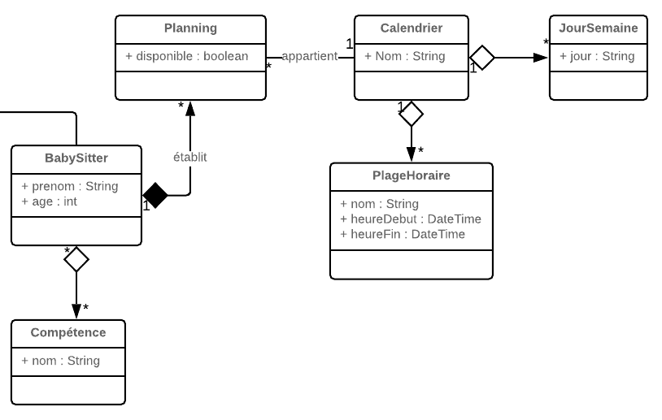
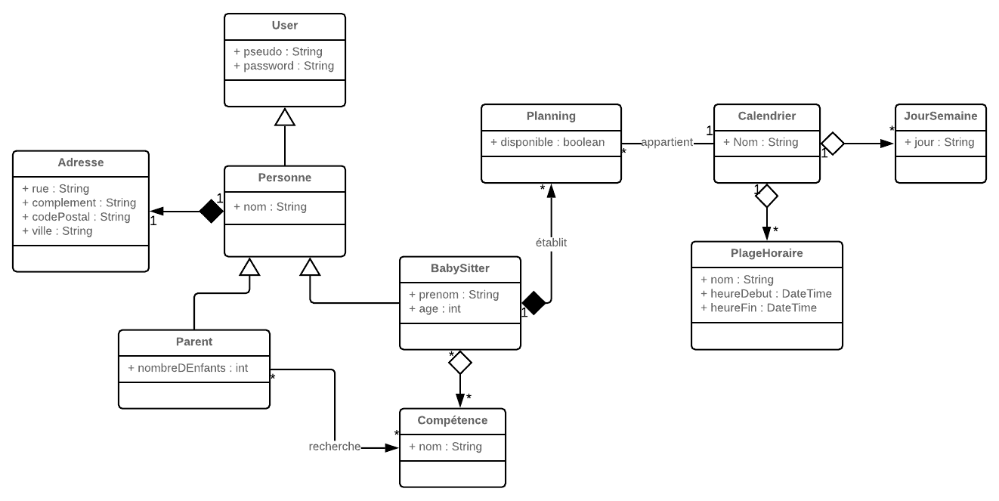

Je vous propose de modéliser un site de réservation de babysitting.  
Dans cet étude, on n'écrira pas les opérations sur les classes.  

## L'étude

L'application permet de mettre en relation un babysitter et des parents d'enfants.  
Le babysitter s'inscrit sur le site, il donne :

* son nom, son prénom, son age
* son adresse postale
* ses compétences (anglais, musicien, ....)
* ses disponibilités dans un calendrier hebdomadaire  

Le parent s'inscrit sur le site, il donne :

* son nom
* le nombre d'enfants à garder
* son adresse postale  

Le parent et le babysitter doivent s'identifier pour accéder au site.  

Le calendrier est composé :

* de jours dans la semaine (lundi, mardi,...)
* de plages horaires (heure de début, heure de fin)

Le parent recherche un babysitter disponible, pour une date donnée, sur une plage horaire de son choix, et peut choisir des compétences.
La recherche affiche la liste des babysitters disponibles.

## Une solution

### Définition des entités

Dans un 1er temps, il faut définir les entités sans les relier entre elles.  
La 1ère erreur que fait un débutant lorsqu'il démarre un diagramme, c'est de partir dans le détail.
Par exemple, il commence à penser comment un parent va interagir avec un babysitter, ou il définit comment un babysitter enregistre ses disponibilités.  
Il finit par concevoir un schéma complexe.  
En fait, il faut commencer par définir les acteurs et le référentiel.

#### Les acteurs

Les acteurs sont les entités qui interagissent sur le système.  
Il y a 2 acteurs :

* le babysitter
* le parent  

Ces 2 acteurs doivent s'identifier.  
Ils hériterons donc de User qui est une entité classique de connexion à un site.  
Nous ajoutons la notion d'adresse.  

Puis on relie les classes entre elles.  

* On s'aperçoit que babySitter et Parent ont en commun le nom et l'adresse.
* On a créé la classe Personne.
* BabySitter et Parent héritent de Personne
* L'adresse est fortement lié à Personne (1,1)

#### Le référentiel

Le référentiel est composé d'éléments qui évoluent très peu.  
Ici, nous avons des compétences :

un calendrier:  

  

un calendrier avec des relations :

* Un calendrier se compose de plusieurs jours
* Un calendrier est découpé en plage horaire
* Ce sont des aggrégations car Une plage horaire et un jour de semaine peuvent vivre si on supprime un calendrier.

### Les relations du babysitter

Un babysitter possède des compétences et met ces disponibilités dans le calendrier.  

* Le baby-sitter a plusieurs compétences
* Il construit un planning où il donne ses disponibilités
* Ce planning est enregistré dans un calendrier

### Le schéma final

  
* Nous avons ajouté une relation entre le parent les compétences car les compétences recherchées par les parents sont des données persistantes (le parent ne ressaisit pas à chaque requête les compétences qu'il désire.)  
