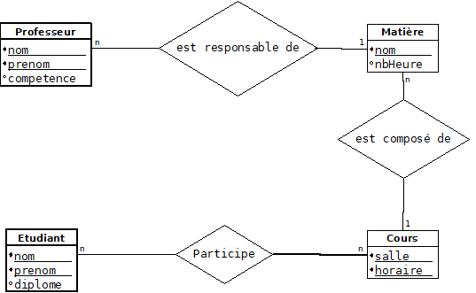

Vous avez peut-être entendu parlé de Merise, et plus particulièrement de MCD, MLD, MPD. Merise une méthode d'analyse, de conception et de gestion de projet informatique.  C'est une méthode *"concurrente"* à UML.  
Merise est toujours très prisée par certains concepteurs. Cette méthode est très orientée données.  
Aussi pour un langage objet comme Java, nous préférons utiliser le diagramme des classes du langage UML.  
Cependant, il existe de fortes similitudes de raisonnement. Nous allons donc en parler pour votre culture.

## Le MCD

C'est le Modèle Conceptuel de Données. L'équivalent UML est le diagramme des classes du MOO.  
Dans le MCD, on parle d'entités et de relations. L'entité c'est la classe du MOO, représentée par un rectangle. 
La relation correspond à l'association dans le MOO. Elle est représentée par un ovale (ou un losange). Nous avons aussi des cardinalités.  
L'entité a un identifiant et des propriétés. La relation est un verbe et peut avoir des attributs.
  

## Le MLD

Le Modèle Logique de Données est la transformation du MCD en ensemble de tables.  
Une entité devient une table. Un identifiant devient la clef primaire. Une propriété devient un champ.  
A ce niveau là apparaît la clef étrangère.

## Le MPD

Le Modèle Physique de Données est la transformation du MLD dans le format d'une base de données. Le résultat final sera un script SQL qui permettra de créer la base dans le SGBDR. Il y a un MPD par modèle de base (Oracle, PostgreSQL, MySql).
Ici va apparaître la valeur et longueur des données.
