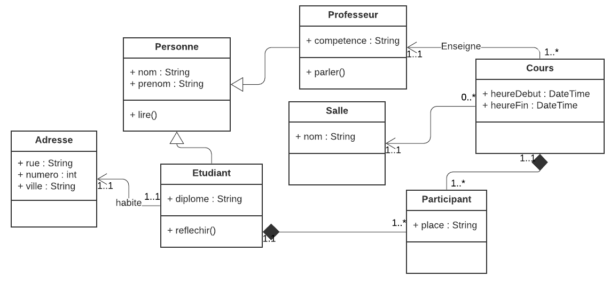
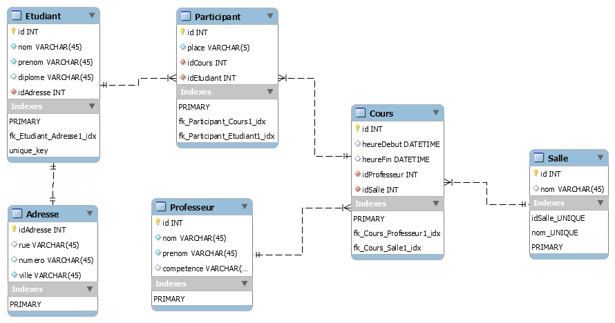

Nous allons générer une base de données relationnelle à partir de la modélisation UML d'un enseignement.  
La base de données que nous utilisons est MySQL.  
Pour cela, nous allons créer le schéma physique, en utilisant MySQL Workbench.

## Génération des tables à partir des classes

Pour rappel voici le diagramme des classes que nous avons généré lors de la conception objet.  

Et voici le schéma physique de la base de données que nous allons créer.

## Explications

* Toute classe persistante (sauf héritage) devient une table
* Une table a besoin d'une clef primaire. Ce sera un identifiant unique appellé id.
* Toutes les propriétés de la classe deviennent de champs de table
* Les relations deviennent des RelationShip non identifiée

### La classe

* A chaque classe correspond une table
* Nous ne créons pas de table pour une classe non persistante (qui n'est pas sauvegardée).  
* Nous ajoutons un id typé int, unique, pk (primary key) et auto-indenté. C'est un attribut qui n'existait pas en UML.
* Tout attribut devient un champ.  
Il faut déterminer le type de donnée le plus proche
  * int : INT
  * String : VARCHAR, de longueur fixe
  * Date : DATETIME
* Il n'y a pas d'opération dans une base de données

### Héritage

Etudiant hérite de Personne.  
Nous avons 2 solutions :

* créer 2 tables : Personne et Etudiant
* importer les champs dans la table fille : créer Etudiant avec les champs de la classe Personne

C'est cette dernière qui a été choisie.

### Les relations

Les relations de classe deviennent des relations non identifiés.  
Ceci génère une clef étrangère.  
Autre point très important, en base de données relationnelle, il n'existe pas de tableau.

#### La relation 1 1

A--->B  
2 solutions :

* copier des attributs dans la classe B dans la classe A si B n' a pas d'autre relation.
* créer 2 tables : table A et table B, et créer une relation 1..1 entre les deux.

Par exemple la relation Etudiant et adresse sont 1..1.
Comme Adresse n'a pas de relation avec d'autres tables, tous ses champs peuvent être copiés dans Etudiant et la classe Adresse ne génère pas de table.  
Mais ici, on a prévu l'avenir : un professeur pourrait avoir une adresse.

#### La relation 1 * et agrégation

A 1--->\* B  

Comme la table A ne peut pas contenir de tableau, c'est la table B qui référence la table A.
La table A ne connaît pas la table B.  
Ceci ce traduit par l'import de l'id A dans la table B.  
C'est ce que l'on appelle une clef étrangère.

#### La relation \* \*

A *--->* B  

La relation \*..\* devient une relation n..n.
Cependant, en base de donnée relationnelle, cette relation n'est pas possible.  
Ceci entraîne la création d'une table intermédiaire contenant les id des 2 tables.
tableA contenant idA  
tableB contenant idB  
tableC contenant idC et l'import de idA et idB.  

C'est le cas de participant.

## Les clefs et index

Les clefs et les index permettent un accès rapide aux données, et servent aussi de contrainte d'intégrité de la base.

### La clef primaire

La clef primaire est constituée d'un id. C'est un entier auto-incrémenté qui est unique.  
Ceci simplifie grandement les relations entre les tables.  
Il a l'inconvénient de ne pas contrôler les doublons.  
Il s'agit d'un id technique qui ne doit pas être visible pour l'utilisateur car il n'a pas de sens.  
Même si la clef primaire n'est pas obligatoire en MYSQL, vous devez en déclarer une **obligatoirement**.  
C'est une erreur de conception d'avoir une table sans clef primaire.

### La clef fonctionnelle ou clef unique

La clef fonctionnelle (ou clef unique) est l'ensemble des champs constituants l'unicité d'un enregistrement (id primaire exclu).  
L'ajout de cette clef vous oblige à déterminer l'unicité des enregistrements et contribue fortement à l'intégrité de la base.  
Pour rappel : l'id est un concept technique, il ne doit pas être vu par l'utilisateur.  
C'est la clef fonctionnelle qui compte pour un utilisateur.
Cette clef est appelée aussi clef unique. Elle est composée d'un ou plusieurs champs.  
Par exemple, un étudiant est identifié par son nom et prénom (et non un id). C'est ce couple qui doit être unique.
L'id étudiant n'a pas de signification, c'est un numéro pour la gestion de la base.

#### Champ unique

Si la clef unique ne contient qu'un champ, c'est ce champ qu'on rend unique.
C'est dire 2 enregistrement ne pourront pas avoir cette même valeur.  
Prenons l' exemple d'un produit qui a un champ *reference*. Il est unique. Il ne peut y avoir 2 produits qui ont la même référence.  

#### Champs multiples

Si la clef fonctionnelle contient plusieurs champs, on la définit grâce à un index unique composé des champs la composant.  
Pour Etudiant, il ne peut pas avoir 2 personnes avec le même couple nom, prénom.  

### clef étrangère

La clef étrangère fait la relation entre les 2 tables et maintient en partie l'intégrité de la base.  
C'est une contrainte de base.  
Cette clef vérifie si l'enregistrement étranger existe.  
Ceci est très utile lors de la création et la suppression d'un enregistrement
Dans une relation 1 \*, c'est la table proche de * qui contient la clef étrangère.  
Dans une relation \* \*, on décompose en 2 relations 1 \*.  
Dans une relation 1 1, on décide d'une table maître.  

### index

Les index permettent une lecture plus rapide de la base en fonction des champs indexés.  
En théorie, on pourrait avoir autant d'index que de critères de recherche.  
Cependant les index sont coûteux en place et en temps d'écriture.  
De plus les processeurs et les moteurs de base de données sont devenus très performants.  
Une lecture séquentielle est bien souvent plus efficace.  
En fait tout dépend de l'utilisation de la base :

* nombre d'enregistrements
* table utilisée principalement en lecture
* table utilisée principalement en écriture
* fréquence de la requête
