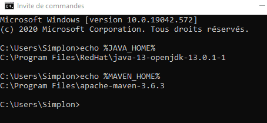

## Git

Télécharger git sur le [site](https://git-scm.com/downloads).
L'installation est dans le dossier C:\Program Files\Git.  
Vérifier l'installation en ligne de commande : `git --version`

## Java

### OpenJDK

Télécharger l'openJDK sur [RedHat](https://developers.redhat.com/products/openjdk/download).
Prendre le MSI de la version la plus récente.
Le MSI installe Java dans le dossier C:\Program Files\RedHat.

### Maven

Télécharger Maven sur [apache](http://maven.apache.org/download.cgi).
Prendre le Binary zip archive et le décompresser dans c:\Program Files

### Variables d'environnement

Il faut déclarer `JAvA_HOME` et `MAVEN_HOME` dans les variables d'environnement.  

## Javascript

### NodeJS

Télécharger sur le site de [node.js](https://nodejs.org/fr/download/).
Prendre le MSI de la version LTS la plus récente.
Node, ainsi que npm sont installés dans le dossier C:\Program Files\nodejs.  
Vérifier l'installation en ligne de commande :

* node -v
* npm -v

### Yarn

Télécharger l'installateur sur [yarn](https://classic.yarnpkg.com/fr/docs/install/#windows-stable).
Le programme est installé sous C:\Program Files (x86)\Yarn.  
Vérifier en ligne de commande : `yarn --version`
