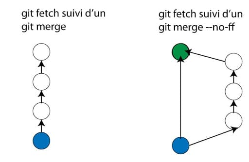
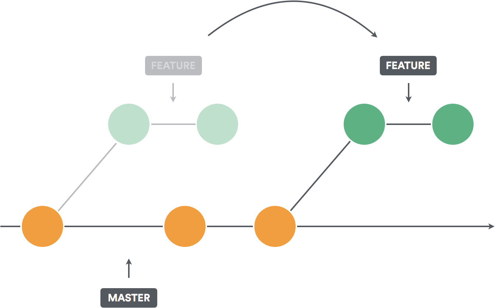
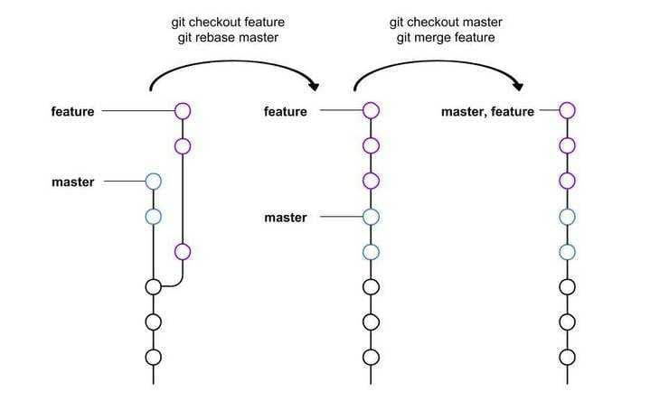

Nous voyons l'utilisation des branches sur son repo local.  

## Manipuler les branches

* Lister les branches  
`git branch`
* Créer une branche  
`git branch maBranche`
* Changer de branche  
`git checkout maBranche`
* Aller sur une nouvelle branche
C’est un raccourci des 2 commandes précédentes : git branch + git checkout  
`git checkout -b maBranche`
* Supprimer une branche  
`git branch -d maBranche`

## Comparer 2 branches

* Comparer 2 branches (verbeux)  
`git diff branche1 branche2`
* Comparer 2 branches et aller à l’essentiel  
`git diff branche1 branche2 --compact-summary`
* Comparer avec la branche en cours  
`git diff laBrancheAComparer --compact-summary`

## Fusionner 2 branches

La fusion est la réunion de 2 branches. On a créé une branche fille en partant de la branche mère. C’est cette branche mère qui récupère les commits de la fille.  
Il faut :

1. se positionner sur la branche mère  
`git checkout brancheMere`
1. fusionner en indiquant la branche fille  
`git merge brancheFille`
1. gérer les conflits  
`git status`  
résolution des conflits avec VS Code
1. ajouter les fichiers dans le stage  
`git add lesFichiersIncriminés`
1. finir la fusion  
`git push`
1. en option : supprimer la branche fille  
`git branche -d brancheFille`

### Historique

Pour ne pas avoir trop de branches en historique, référer vous au workflow : ne garder pas de branche locale.
Conserver uniquement les branches features.  

Le fait de supprimer une branche ne supprime pas les commits.
Si vous utilisez un éditeur graphique des branches (comme git graph), vous verrez toujours cette branche, mais elle n'aura pas de nom.

La solution pour ne plus voir de branche est de faire un `rebase`.

### Option fast-forward

Par défaut, un merge fonctionne avec fast-forward. Il est possible de désactiver cette option.
Les options lors du merge sont : `--ff` ou `--no-ff`.

Mais qu’est ce qu’un fast-forward ?  
Lorsque vous faites des modifications sur une branche (develop), à la fin du dev vous fusionnez avec la branche d’où vous êtes parti (master).  
Si la branche maître n’a pas reçu de modification, l’historique de votre branche est intégrée dans le master et vous perdez cette notion de branche puisque tout est linéaire.  
Ceci n’arrive pas si la branche master a évolué en parallèle (nouveaux commits) depuis la création de la branche.  
Si vous souhaitez garder cette branche (faire un true merge), il faut faire un merge avec l’option --no-ff. Un commit de fusion est créé.  
Ce fast-forward n’a aucune incidence si vous faites des petites branches locales. Par contre si vous fusionnez sur des branches principales comme production (master) et développement (develop), il faut faire un merge avec no-ff.  

### Changement de la config par défaut

Git permet les réglages persistants au niveau général, au niveau du dépôt , ou au niveau de la branche. git config [--global]

* merge.ff = false  
désactive le fast-forward par défaut. Il faudra mettre l’option merge --ff pour faire un fast-forward. Attention lors d’un pull (fetch+merge), il y a création d’une branche.
* branch.master.mergeoptions = --no-ff  
désactive le fast-forward sur la branche master
* branch.master.mergeoptions = --ff-only  
oblige à faire des merges fast-forward et empêche le true merge.
* pull.ff only  
Si vous avez désactivé le ff pour tous, vous ajouter une exception pour le pull

## Le rebase

Vous avez créé une branche. La branche mère a évolué et vous voulez récupérer les changements.  
Le rebase va indiquer à votre branche un nouveau commit de départ.  
Ainsi vous récupérer toutes les évolutions de la branche mère et les commits de votre branche.  
Bien entendu, il peut y avoir des conflits sur les fichiers, conflits qu'il faudra résoudre.  

### La commande

`git rebase brancheMere`

### En gestion de projet

Pour rappel, un développeur crée toujours une branche dès qu'il écrit du code.  
Il peut utiliser le rebase soit pour éviter de fusionner les branches, soit gérer les conflits de fusion le plus tôt possible.

Voici la démarche :

* création de la branche featureDevLocal
* ajout de code
* plusieurs commit
* rebase
* faire des rebase réguliers, au cours du dev, au minimum une fois par jour
* en fin de développement, faire un rebase, puis immédiatement un merge.
* vous avez perdu la notion de branche, tout est linéaire.

> Attention ! ne faites pas de rebase si vous avez poussé votre branche sur le remote. Vos collègues vont vous haîr. Rebasez uniquement les commits en local.  

### Gestion des conflits

Lorsque vous faites un rebase, Les commits de la branche mère sont appliqués 1 par 1.
Un conflit peut apparaître à chaque fois qu’un commit est rejoué.
Si vous avez un conflit, le rebase s'arrête et vous demande de résoudre le conflit.

* faites un `git status`
* quand vous avez résolu le conflit, ajouter le fichier dans l’index (add ou rm).
* faites un `git rebase --continue`
jusqu’à ce que git status ne dise plus rien
* Vous pouvez arrêtez tout le rebase par `git rebase --abort`

## Le rebase interactif

Le rebase interactif permet de restructurer les commits.
Vous pouvez modifier l’ordre des commits, renommer un commit, concentrer plusieurs commit en un.  
Pour cela, vous indiquez le niveau du rebase : `git rebase -i HEAD~n`, où n est un nombre.  
L’éditeur de code s’ouvre avec tous les commit dans l’ordre chronologique. A vous de réorganiser dans l’ordre voulu :

* pick : conserve le commit
* squash : fusion avec le commit précédent en indiquant un nouveau commentaire
* fixup : fusion sans commentaire
* drop supprime un commit
