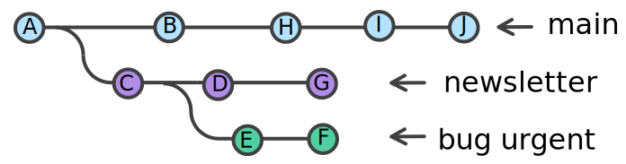

Au secours mon git ne fonctionne plus. J'ai fait une bêtise et veut revenir en arrière.  

## Github a renommé master

Github a renommer la branche `master` en `main`.
Tout va bien si vous créer un nouveau dépot et faites un clone de ce repo.  
Mais parfois, vous tout cela se complique si vous avez déjà un repo local, et que vous avez fait un `git init`.  
Le plus simple est de créer un repo vide sur github. Voici la démarche :

```sh
git init
git add --all
git commit -m "first commit"
git branch -m master main
git remote add origin urlDuRepo
git push -u origin main
```

Si vous créer un dépot avec un READ.ME et un .gitignore, la procédure est légèrement différente.

```sh
git init
git add --all
git commit -m "first commit"
git branch -m master main
git remote add origin urlDuRepo
git pull origin main --allow-unrelated-histories
```

## Démarche de création d'un projet Maven suite au changement de branche par défaut

1. Pour l'artifactId de Maven (nom du projet), utilisez le même nom de repo Github
1. Créer votre dépot sur Github
1. Faites un `git clone` en local
1. Créer le projet Maven, en indiquant le dossier parent au nom du projet (le dossier qui contient le repo local git)
1. Maven vous indique que le dossier existe déjà. Il complète les fichiers.
1. il n'y a pas conflit avec Github et vous êtes sur la branche `main`

## Vous voulez supprimer un fichier sur le remote

Vous avez envoyé par erreur vos coordonnées bancaires sur le remote (ces infos étaient dans un fichier de config).  
`git rm` ne supprime pas l'historique.

Il faut utiliser la commande suivante :  

```sh
git filter-branch --force --index-filter 'git rm --cached --ignore-unmatch monFichier' \ --prune-empty --tag-name-filter cat -- --all
```

## Vous n’êtes pas sur la bonne branche et n’avez pas commité

Il faut remiser le travail (working + stage), basculer sur la branche, puis récupérer le travail remisé.

```sh
git stash
git checkout laBranche
git stash apply (ou git stash pop)
```

## Vous n’êtes pas sur la bonne branche et vous avez commité

Cependant vous n’avez pas poussé sur le dépôt distant (push).  
If faut noter le sha1 du dernier commit, déplacer le HEAD sur le commit précédent, se déplacer sur la branche, puis replacer le HEAD sur le commit noté.

```sh
git log #(=> shaDernierCommit)
git reset --hard HEAD^
git checkout maBranche
git reset --hard shaDernierCommit
```

## Vous voulez supprimer les 2 derniers commits (non pushés)

Vous avez effectué 2 commits, et vous ne voulez pas les garder dans l’historique (revert).  
Imaginons que vous êtes sur la branche master, votre HEAD pointe sur le dernier commit.

```sh
git branche feat/asupp
git reset --hard HEAD~2
git status
git branche -D feat/asupp
```

## Vous voulez corriger le message du dernier commit

```sh
git commit --amend -m “nouveau message”
```

## Vous avez oublié un fichier lors du dernier commit

```sh
git add leFichier
git commit --amend --no-edit
```

Commande identique pour modifier un fichier commité.  
Si vous voulez supprimer un fichier, à la place du add c’est un rem

## Vous avez commité un fichier par erreur

Vous avez commité un fichier que vous ne voulez pas voir dans le depo.  
Vous allez positionner le HEAD sur le commit précédent sans modifier le stage ni le working. Vous supprimer le fichier indésirable du stage. Vous commiter.

```sh
git reset --soft HEAD~1
git reset monFichier
git commit -m "comment"
```

## Vous avez pushé un commit erroné

Il faut annuler ce dernier commit sur le serveur.  
Comme c’est sur le remote, on ne va pas supprimer le commit, mais créer un nouveau commit qui annule les maj.

```sh
git revert HEAD^
correction des conflits (git add/rm)
git revert --continue
git push
```

## Vous voulez annuler les modifications locales d’un fichier

Vous avez abandonné toutes les modifications faites dans un fichier . Vous allez récupérer l’image de ce fichier archivée lors du dernier commit.  

```sh
git checkout [HEAD] monFichier.txt
```

## Vous voulez annuler toutes les modifications locales

Vous avez modifié des fichiers et plus rien ne fonctionne. Vous voulez revenir à la version du dernier commit

```sh
git reset --hard [HEAD]
```

## Vous voulez annuler la dernière opération modifiante importante (merge, rebase, pull)

1. faites un reflog pour repérer sur quel sha1 vous voulez positionner votre branche
1. Vérifier que vous êtes sur la bonne branche
1. `git reset --hard leSha1Repéré`

## Vous avez un merge en conflit que vous voulez annuler

```sh
git merge --abort
```

## Vous avez ajouter des fonctionnalités sur une mauvaise branche

Scénario : j'ai créé une branche newsletter pour travailler sur la fonctionnalité correspondante. J'ai également créé une branche bug_urgent pour corriger un bug qui doit être fixé urgemment, comme son nom l'indique.

Sauf que, au moment de fusionner ma branche bug_urgent, horreur ! malheur ! je m'aperçois que je n'ai pas créé ma branche au bon endroit. Mon historique ressemble à ça.  



Catastrophe ! Ma branche newsletter est un travail en cours, mais bug_urgent doit absolument être fusionnée dans main, le commercial a une démo dans 5 minutes.  
Comment faire ?!

Git rebase à la rescousse ! Nous allons simplement transplanter bug_urgent sur master, et le tour est joué.

```sh
git rebase newsletter bug_urgent --onto master
git checkout master
git merge bug_urgent
```


## Récupérer une branche supprimée

Vous avez supprimé une branche. Celle ci n’est pas fusionnée. Tant que le Garbage Collector n’est pas passé, vous pouvez la récupérer. Identifier le dernier commit fait sur cette branche avec reflog, puis recréez cette branche en indiquant le commit.

```sh
git reflog => liste des commits
git fsck --lost-found => si vous ne trouver pas votre commit dans le reflog
git branch nomBranche shaDernierCommit
```

## Revenir en arrière lors d’un merge fast-forward

Vous avez fait un merge. Vous vouliez un true merge et c’est un fast-forward. Pas de panique, vous revenez en arrière sur les 2 branches avec un reset, puis refaite le merge avec no-ff.

```sh
git checkout master
git reset @{1}
git merge develop --no-ff
```
