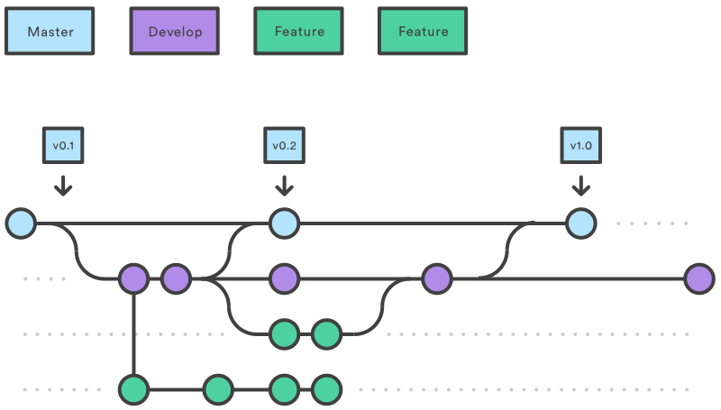

Git ne vous donne aucune contrainte. C’est à vous de gérer vos versions, vos branches.  
Au bout d’un certain temps, le chaînage est tellement complexe que plus personne ne comprend rien, d’autant plus lorsque vous travailler à plusieurs.  
Vous avez tout intérêt à être rigoureux et d'utiliser le workflow que nous détaillons dans cet article.

Source : Atlassian

## Le principe

Lorsque l'on travaille en équipe, il y a conflit sur les sources. En effet deux personnes peuvent modifier en même temps un fichier.  
Pour limiter les conflits, chaque développeur utilise une branche qui lui est propre.
Lorsqu'il a finit son développement, il fusionne son travail avec le reste de l'équipe.
C'est à ce moment qu'il doit gérer les conflits.  
Pour cela, nous allons utiliser des branches pour gérer les versions et d'autres branches pour ajouter les fonctionnalités.

## Les branches principales

L'application aura deux branches principales :

* Une branche de production qui est le **main** (master)
* Une branche de développement appelée **develop**

### La branche main

Cette branche représente le logiciel mis en production. AUCUNE modification n’est directement faite sur cette branche. Elle va être alimentée par la fusion avec la branche develop et les hotfix.  
Lorsque l'on a la possibilité, on protège cette branche en écriture. Les push se transforment en Pull Request. Ceci accroît la sécurité.  
Sur cette branche, on retrouvera les tags des versions.  
Cette branche est réservée au devOps, ou à la personne responsable du déploiement en production.

### La branche develop

La branche de développement est créée dès la création du repo. C’est la branche de travail, dédiée aux développeurs.  
C’est sur cette branche que chaque développeur dépose son travail. Lorsque le logiciel part en production, on fusionne cette branche avec le main.

## Les branches secondaires

### feature

Lorsque l’on ajoute une fonctionnalité (feature) au logiciel, on crée une branche secondaire à partir de la branche development.  
Lorsque cette fonctionnalité est terminée, on fusionne avec la branche development. On peut travailler à plusieurs sur cette branche.  
Cette branche est gardée dans l’historique du remote.

### hotfix

Il s’agit de branches contenant un petit correctif effectué sur la branche de production.  
Note : il n'y a pas de hotfix sur le schéma.

### release

Il s’agit de branches contenant un correctif suite aux tests d’intégration. Ils partent de la branche de develop.  
Note : il n'y a pas de release sur le schéma.

### Les branches temporaires

Ce sont des branches qui restent en local sur le poste de travail du développeur.  
Dès qu'un développeur veut créer du code, il décide à partir de quelle branche il va travailler.  
Il crée en local une branche à partir de cette branche mère, et ajoute son code.  
Lorsqu'il a finit son travail (ou au fil de l'eau), il met à jour la branche mère (feature) avec un pull.
Ceci n'entrave pas son travail puisqu'il a sa propre branche.  
Maintenant, il peut fusionner sa branche locale avec la branche feature.
C'est ici qu'il gère les conflits.  
Lorsque la fusion est fait, il supprime la branche locale pour ne pas polluer le graphe.
Elle n'apparaît donc pas sur le remote.
> Ne jamais faire un push d'une branche temporaire. Elle pert la caractéristique de locale et vous ne pouvez plus faire de rebase.
