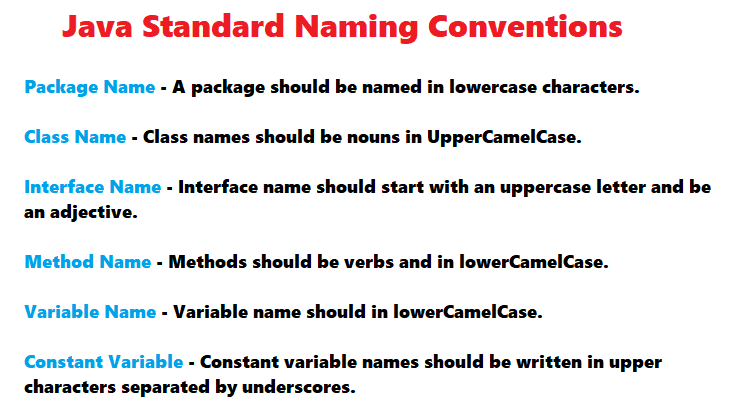

## Commenter le code

Avant toute chose, il convient de parler des commentaires ! C'est certainement une des choses les plus importantes que l'on écrit lorsque l'on code. Ce sont des lignes de code qui ne seront pas interprétées mais qui donnent des indications primordiales pour les programmeurs qui liront le code (y compris vous dans quelques mois / années).

```java
// Voici comment j'écris un commentaire en java :
// en démarrant ma ligne de code par //
// C'est vraiment très important de documenter son code en mettant des bons
// commentaires pour les futurs développeur•euse•s
// J'espère que vous le ferez !
```

On peut aussi regrouper plusieurs lignes de commentaires ainsi :

```java
/*
Je peux dire n'importe quoi, le compilateur ne le lira pas
par contre les autres développeurs, si :)
*/
```

> Question : quelle est votre priorité en tant que développeur?

* [ ] que votre code fonctionne?
* [x] que votre code soit maintenable? (eh oui!)

## Écriture des mots, les mots libres et les mots réservés

Java est un langage composé de mots. Un mot peut avoir avoir une signification dans une langue humaine, ou pas.  
Par exemple, je peux utiliser le mot `maVoiture`, mais aussi `vlkgfdc`.  
Écrire un mot qui n'a pas de signification pour un être humain n'aide pas à la compréhension du code.
Il est donc important de respecter les conventions de nommage.
Pour le nom des variables, les noms des classes, etc.., on utilise la convention camelCase.
Les classes doivent commencer par une majuscule, et les variables par une minuscule.
On n'utilise jamais d'accent.



Cependant certains mots ne sont pas libres. Par exemple, nous ne pouvons pas nommer notre variable `int`.  
C'est ce que l'on appelle un mot réservé. En voici la [liste](https://fr.wikibooks.org/wiki/Programmation_Java/Liste_des_mots_r%C3%A9serv%C3%A9s).

## Variables et types de données

Les variables en java permettent de stocker des données en mémoire pour pouvoir les utiliser ensuite. Les variables sont typées (type nombre, mot, ...) et sont créées en deux phases :

* déclaration
* initialisation

```java
int unNombre; // on déclare que le type de la variable est 'int'
unNombre = 17;
```

On peut rassembler ces deux phases en une seule instruction :

```java
int unNombre = 17;
```

Une fois qu'une variable est déclarée, on ne peut pas changer son type. On peut cependant lui affecter de nouvelles valeurs.

```java
int unNombre = 17;
unNombre = 13; // ok
unNombre = "abc"; // no!
```

```java
int unNombre = 17; // primitives en minuscules
char initiale = 'b';
double monSouvenirDePi = 3.1415;
boolean simplonAMontreuil = true;

String unMotOuUnTexte = "hey jude, don't make it bad"; // String n'est pas un type primitif : commence par une majuscule
```

Pour afficher le contenu d'une variable, on utilise `System.out.println` :

```java
int unNombre = 17;
int unAutre = 23;
int total = unNombre + unAutre;
System.out.println(total);
```

### Les nombres

Deux grand types de nombre nous seront utiles : les `int` qui représentent les nombres entiers et les `double` qui représentent les nombres décimaux.

```java
int monAge = 30;
int ageMatusalem = 1_042; // le tiret du bas peut être utilisé pour rendre visuellement les nb plus faciles à lire

// Ma taille en cm
double taille = 184.5;
```

> Remarque : il existe d'autres types de nombres entiers : byte, short, long et d'autres types de décimaux : float. Mais ils sont utilisés plutôt pour des questions d’optimisation de programme.

On peut **caster** (=convertir) des types en d'autres, mais attention au résultat :

```java
int a = 10.0; // a = 10, rien à faire
a = (int)3.14; // a = 3, il faut faire le cast
```

Pour plus de détails : [La documentation officielle de java](https://docs.oracle.com/javase/tutorial/java/nutsandbolts/datatypes.html)

### Les caractères

Ce type de données ne permet de stocker qu'un seul caractère : chiffre, lettre, symbole.

```java
char initialeMajuscule = 'J';
char dernierLettre = 'n';
char unNombreOuBien = '1';  // c'est bien le caractère 1, et pas un nombre sur lequel on peut faire des opérations
```

### Les chaînes de caractères

Afin de stocker du texte (un prénom, un nom, une phrase, ...) nous utiliserons les `String` qui représentent les chaînes de caractères.
Notez que `String` commence par une majuscule.

```java
String prenom1 = "Josselin";
String prenom2 = "Philippe";
String starP3 = "Jean Michel Doudoux"
```

On peut utiliser un certain nombre de caractères spéciaux qui n’apparaîtront pas en les **échappant** avec un backslash :

```java
String menu = "Faites votre choix :\n1-Pour démarrer\n2-Pour quitter";
System.out.println(menu);
```

Qui s'affichera ainsi :

```texte
Faites votre choix :
1-Pour démarrer
2-Pour quitter
```

Pour plus de détails : [La documentation officielle de java](https://docs.oracle.com/javase/tutorial/java/data/strings.html)

### Les booléens

Le type de données élémentaire à connaître qui est à la base de l'informatique d'aujourd'hui est le booléen. Il s'agit d'un type de données qui n'a que deux valeurs possibles : `true`ou `false`. Cela correspond au `0` et au `1` du binaire (le yi et le yang de l'informaticien). Nous l'utiliserons beaucoup lorsque nous aborderons les conditions.

```java
// Une vérité
boolean jeTravailleASimplon = true;

// Un mensonge
boolean jeSuisPlusRicheQueBillGates = false;
```

### Le type vide

`void` est utilisé pour informer qu'une méthode/fonction ne renvoie pas de résultat.

### Le type null

`null` est utilisé pour indiquer qu'un objet n'existe pas. Il est `null`.

### Le tableau

Un tableau est une structure de données contenant un groupe d'éléments, tous du même type.
Un tableau est de longueur finie. Pour définir un tableau, nous utilisons les crochets [].  
Les tableaux peuvent être de une ou plusieurs dimensions. Au delà de 2, il est préférable d'utiliser une autre structure.  
Pour accéder à un élément du tableau, nous utilisons l'indice. Le premier indice commence à 0.
Si nous tentons d'accéder en dehors de ses limites, la JVM lève l'exception (erreur) `ArrayIndexOutOfBoundsException`.
Pour cette raison de taille finie le tableau est souvent délaissé au profit d'autres structures plus souples d'utilisation.

```java
public static void testTableau() {
    int tableauEntier[] = {0,1,2,3,4,5,6,7,8,9};
    String tableauChaine[] = {"Jean", "Bon", "Beurre", "sncf"};
    int tableauEntier2[] = new int[6];
    int premiersNombres[][] = { {0,2,4,6,8},{1,3,5,7,9} };

    for (int i = 0; i < tableauChaine.length; i++) {
        System.out.println(tableauChaine[i]);
    }

    for (int i = 0; i < premiersNombres.length; i++) {
        for (int j = 0; j < premiersNombres[i].length; j++) {
            System.out.println(premiersNombres[i] [j]);
        }
    }
}
```

## Les opérateurs

### Opérations de base sur des nombres

On peut utiliser les 4 opérations sur des nombres. Les résultats obtenus sont sans surprise.

```java
int soldeCompte = 150;
int retrait = 20;

int nouveauSolde = soldeCompte - retrait;

int depot = 105;
nouveauSolde = soldeCompte + depot;
```

Les opérations `+,-,*,/` sur des nombres entiers donnent des nombres entiers.
Les opérations `+,-,*,/` sur au moins un nombre double donnent des nombres double.

```java
int soldeCompte = 150;
double depot = 10.0;

double nouveauSolde = soldeCompte + depot;

double pourcentage = 0.3;
nouveauSolde = soldeCompte * 0.3;
```

Pour la division, attention au cas des nombres entiers :

```java
int nbPartPizza = 4;
int nbPersonne = 2;

int nbPart = nbPartPizza/nbPersonne; // 2 bien sur

nbPartPizza = 5;
nbPart = nbPartPizza/nbPersonne; // 5/2 = 2, attention
```

> Pour avoir le résultat de la division précédente exact, on **caste** un des deux nombres `int` en `double` :

```java
int a = 4;
int b = 2;
double exact = a/(double)b;
```

Les priorités de calcul sont les priorités habituelles, on peut utiliser des parenthèses.

```java
int a = (2+4)*3; // 18
int b = 2+4*3; // ?
```

### Division entière

On utilise souvent en informatique la division entière qui donne deux résultats : le reste et le quotient.

```java
int etudiants = 26;
int nbGroupes = 3;

int etudiantsParGroupe = 26 / 3; // un résultat entier
int etudiantsRestant = 26 % 3; // on dit 26 modulo 3
```

### Comparaison

Les relations d'ordre produisent des booleans.

```java
18 < 22; // true
3*5 < 10; // false
2*3 <= 6; // true
2 < 4 < 8; // erreur, l'encadrement ne fonctionne pas en java, il faut utiliser &&
2 < 4 && 4 < 8; // true
"la ligne rouge" < "apocalypse now"; // erreur, il faut comparer des nb
```

On peut bien sur les stocker dans des variables :

```java
int unNombre = 17;
double unAutre = 8.4;

boolean estPlusGrand = (unNombre > unAutre); // true
```

### Egalité

On compare des variables avec `==`, puisque le `=` est déjà utilisé pour l'affectation. Cela produit aussi un boolean. Le signe différent est `!=`.

```java
line1 = "Nah nah nah nah nah nah nah nah nah yeah";
line2 = "Nah nah nah nah nah nah, nah nah nah, hey Jude";
line3 = "Nah nah nah nah nah nah, nah nah nah, hey Jude";

line1 == line2
line2 == line3

isDifferent = line1 != line3 // il est vrai que ces lignes ne sont pas égales!
```

### Opérations avec les booleans

[L'algèbre de Boole](https://fr.wikipedia.org/wiki/Alg%C3%A8bre_de_Boole_(logique)) (c'est à dire les calculs sur les booléens) est à la base de l’électronique. On la retrouve aussi dans les langages de programmation, notamment pour exprimer des conditions (voir plus loin : branchements, et aussi boucles).

Il y a trois opérations importantes à connaître : **et**, **ou**, **non** qui s'écrivent : `&&`, `||`, `!`

```java
int revenu = 26_000;
int seuil1 = 16_000;
int seuil2 = 38_000;

boolean exonere = revenu < seuil1;
boolean doitPaye = !exonere; // on doit payer si on n'est pas exonéré

boolean payeTranche1 = revenu > seuil1 && revenu < seuil2; // si le revenu est compris entre seuil1 et seuil2
```

Un autre exemple avec **ou** :

```java
int note = 12;
boolean noteInvalide = note < 0 || note >20;
```

### Opérations avec des chaînes

On peut concaténer (mettre bout à bout) des chaînes de caractères avec l'opérateur +.

```java
String nom = "Odile";
int age = 34;

String presentation = "Bonjour, je m'appelle "+nom+ " et j'ai "+age+ " ans";
```

## Conditions et branchements conditionnels

### Branchements

Pour effectuer un bloc d'instructions si une condition est vraie, on utilise le mot-clé `if`. Pour délimiter la taille du bloc d'instructions, on utilise des accolades (et de fortement recommandée : une indentation).

```java
int temperature = 10;
String vetement = "teeshirt";

if (temperature < 15) { // on délimite le bloc avec des accolades
  System.out.println("c'est deja l'automne"); // toutes les lignes du bloc sont indentées
  vetement = "pull";
}

System.out.println(vetement);

```

Si la condition est vraie, on exécute les instructions du blocs. Sinon on saute le bloc.

On peut ajouter un bloc à exécuter seulement si la condition est fausse avec `else`.

```java
int temperature = 10;
String vetement = "teeshirt";

if (temperature < 15) { // on délimite le bloc avec des accolades
  System.out.println("c'est deja l'automne");
  vetement = "pull";
}
else  { // un autre bloc : accolades + indentation
  System.out.println("vive le rechauffement");
  // pas la peine de changer de vetement
}

System.out.println(vetement);

```

On peut aussi ajouter d'autres conditions intermédiaires avec `else if`, a exécuter seulement si les précédentes sont fausses.

```java
int age = 2;

if (age < 0) {
  System.out.println("merci d'entrer un age valide (positif)");
}

else if (age < 3) {// on ne rentre pas ici si on est déjà entré dans le cas d'avant
  System.out.println("tarif : gratuit");
}

else if (age < 18){
  System.out.println("tarif : réduit");
}

else if (age > 65) {
  System.out.println("tarif : réduit");
}

else {// dans tous les autres cas
  System.out.println("tarif : normal");
}
```

### Conditions

Dans le cas précédent, on obtient un tarif réduit si l'âge est inférieur à 18 **ou** supérieur à 65. On peut rassembler les deux cas.

```java
int age = 2;

if (age < 0) {
  System.out.println("merci d'entrer un age valide (positif)");
}

else if (age < 3) {// on ne rentre pas ici si on est déjà entré dans le cas d'avant
  System.out.println("tarif : gratuit");
}

else if (age < 18 || age > 65) {
  System.out.println("tarif : réduit");
}

else {// dans tous les autres cas
  System.out.println("tarif : normal");
}
```

Une erreur classique est d'utiliser un **or** lorsqu'il faudrait un **and** ou inversement. Ici par exemple, un age qui est inférieur à 18 **et** supérieur à 65 n'existe pas, il fallait bien utiliser **ou**.

```properties
brocoli = 4
aubergine = 6
concombre = 5
radis = 2
pomme = 3
mure = 9
```

> quelle condition sur les prix pour ne sélectionner que :

```properties
brocoli = 4
radis = 2
pomme = 3
mure = 9
```

Pour plus de détails : [La documentation officielle de java](https://docs.oracle.com/javase/tutorial/java/nutsandbolts/if.html)
