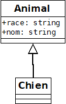

Une classe est décrite par des propriétés et des méthodes. Chaque classe a ses spécificités.  
Le but de l'héritage est de regrouper les propriétés et les méthodes communes dans une nouvelle classe (la classe parente) puis d'hériter de cette classe.  
L'héritage est toujours additif ; il est impossible d'hériter d'une classe et de recevoir moins que ce que possède la classe parent.  
On parle aussi de généralisation.  
Pour hériter d'une classe mère, on utilise le mote clef **extends**.  
En Java, une classe ne peut hériter que d'une seule classe (contrairement au C++).  
L'avantage de l'héritage est une centralisation du code, donc un gain en lignes de code et en maintenance.  
L'inconvénient est la lisibilité du code qui se complexifie.  
Notez qu'en Java toute classe dérive automatiquement de la classe Object.  



Déclaration d'un animal

``` java
public class Animal {
    private String race;
    protected String nom;

    public Animal(String race, String nom) {
        this.race = race;
        this.nom = nom;
    }

    protected String sAnnoncer() {
        return("je suis un " + this.race + " " + this.nom);
    }
}
```

Déclaration d'un chien héritant des caractéristiques de l'animal.

``` Java
public class Chien extends Animal {

    public Chien(String nom) {
        super("chien", nom); // appel du constructeur parent
    }

    public void parler() {
        System.out.println("C'est le chien " + this.nom + " qui parle :"); // appel de la propriété parente
        System.out.println(this.sAnnoncer()); // appel de la méthode du parent
    }
}

```

Lancement de l'application

``` Java
public class App {
    private static Chien rex;
    private static Chien medor;

    public static void main(String[] args) {
        rex = new Chien("Rex");
        rex.parler();

        medor = new Chien("Médor");
        medor.parler();
    }
}
```
