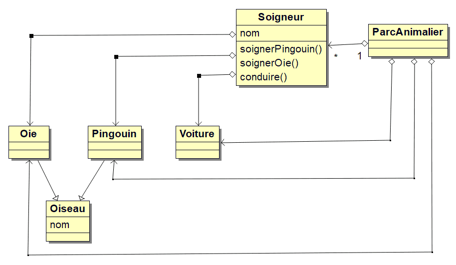
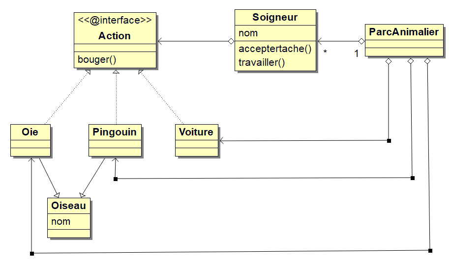

Le polymorphisme d'interface permet de mettre en oeuvre le **design pattern strategy**.
Ce pattern répond à la problématique : comment réaliser simplement des opérations différentes par le même objet.  
Prenons un exemple pour comprendre la problématique.  
Un parc animalier possède une oie, un pingouin, et une voiture. C'est un soigneur qui s'occupe de tout cela.  
Le soigneur demande à ses animaux de bouger. Il conduit aussi une voiture.
On souhaite que cela reste évolutif ; par exemple, l'ajout d'un lion.  

## Avec une dépendance forte

Nous avons 5 classes : Parc, Soigneur, Oie, Pingouin, Voiture.  
Une oie, un pingouin et une voiture sont différents, donc chaque caractéristique et comportement est décrit dans les classes associées.  
Le parc est propriétaire des oies, pingouins et voitures. Il a un soigneur. Il demande au soigneur de s'occuper du tout.  
On peut considérer que le soigneur a 3 types de tâche à effectuer donc au minimum 3 méthodes et 3 classes.  
Si le parc acquière un lion, if faut décrire ce lion dans une nouvelle classe, l'intégrer dans le parc et indiquer au soigneur comment s'en occuper.  



Cette façon de faire a 3 inconvénients :

* le soigneur à autant de méthodes qu'il a de tâches à s'occuper.
* On va avoir tendance à décrire le comportement spécifique du soigneur en fonction de l'animal/voiture. Donc mettre du code côté soigneur.
* L'ajout d'un animal modifie le comportement du soigneur, donc augmente le risque de bug.

## Avec le pattern strategy

Le but est de rendre plus flexible l'ajout d'animaux et donc d'alléger le code écrit dans la classe soigneur.  
Tout code spécifique à un animal est décrit dans sa classe. Le soigneur a un comportement généraliste et n'a plus la notion des classes.  
Pour cela, nous allons utiliser une interface nommée "Action" qui aura ici une seule méthode.
Chaque classe animal et voiture implémente cette interface.
Le soigneur ne verra que cette interface.  
L'ajout d'un animal se résumera à :

* créer une nouvelle classe implémentant Action
* ajouter l'animal dans la classe Parc.

## Le diagramme des classes du parc animalier


  
## Le code source dans package `zoo`

``` Java
public interface Action {
    public void bouger();
}
```

``` Java
public class Oiseau {

    protected String nom;

    protected void sePresenter() {
        System.out.println("Bonjour, je m'appelle " + this.nom);
    }

    public Oiseau(String nom) {
        this.nom = nom;
    }
}
```

``` Java
public class Pingouin extends Oiseau implements Action {

    public Pingouin(String nom) {
        super(nom); // appel du constructeur parent
    }

    private void marcher() {
        System.out.println("Je marche jusqu'à l'étang");
    }

    private void seBaigner() {
        System.out.println("Je nage dans l'eau");
    }

    @Override
    public void bouger() {
        super.sePresenter();
        System.out.println("Je suis un pingouin ");
        this.marcher();
        this.seBaigner();
    }
}
```

``` Java
public class Oie extends Oiseau implements Action {

    public Oie(String nom) {
        super(nom); // appel du constructeur parent
    }

    private void battreDesAiles() {
        for (int i = 0; i < 3; i++) {
            System.out.println("Je bats des ailes");
        }
        System.out.println("Je décolle");
    }

    @Override
    public void bouger() {
        super.sePresenter();
        System.out.println("Je suis une oie ");
        this.battreDesAiles();
    }
}
```

``` Java
public class Voiture implements Action {

    private final String marque;
    private final Soigneur conducteur;

    public Voiture(String marque, Soigneur conducteur) {
        super();
        this.marque = marque;
        this.conducteur = conducteur;
    }

    private void demarrer() {
        System.out.println(
                "Bonjour je suis la voiture " + this.marque + ", et je suis conduite par " + this.conducteur.getNom());
    }

    private void rouler() {
        System.out.println("je roule");
    }

    @Override
    public void bouger() {
        this.demarrer();
        this.rouler();
    }
}
```

``` Java
public class Soigneur {

    private final String nom;
    private final List<Action> listeDActions;

    public Soigneur(String nom) {
        this.nom = nom;
        this.listeDActions = new ArrayList<Action>();
    }

    public void accepterTache(Action tache) {
        this.listeDActions.add(tache);
    }

    public void travailler() {
        System.out.println("Hello je suis le soigneur " + this.nom);
        System.out.println("Je pars au travail");
        for (final Action tache : this.listeDActions) {
            tache.bouger();
        }
        System.out.println(this.nom + " : Ouf ! fin de journée ");
    }

    public String getNom() {
        return this.nom;
    }
}
```

``` Java
public class ParcAnimalier {

    public static void main(String[] args) {

        final Soigneur monSoigneur = new Soigneur("Pascal");

        monSoigneur.accepterTache(new Voiture("Ford", monSoigneur));
        monSoigneur.accepterTache(new Oie("Gertrude"));
        monSoigneur.accepterTache(new Pingouin("Jasper"));
        monSoigneur.accepterTache(new Voiture("Tesla", monSoigneur));

        monSoigneur.travailler();
    }
}
```
