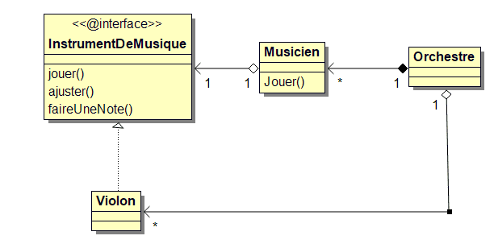
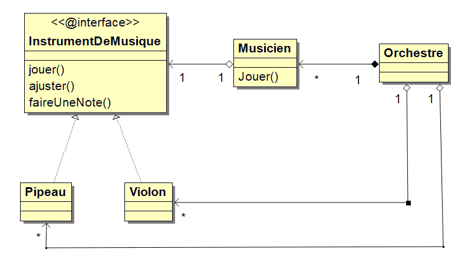

## Définition

Commençons par un petit rappel : une interface est une classe particulière. Elle est totalement abstraite.
Elle indique le comportement d'une autre classe. C'est donc un contrat.  
Imaginons la classe `C1` qui implémente l'interface `I1`. La classe `C2` communique avec la classe `C1`.
Puisque `I1` définit le comportement de `C1`, on va utiliser `I1` dans la classe `C2` à la place de `C1`.  
Maintenant nous ajoutons la classe `C1bis` qui implémente `I1`.
Il n'y a pas besoin de modifier la classe `C2` pour utiliser `C1bis`.

## Un exemple pour comprendre

Reprenons le violon qui implémente l'interface InstrumentDeMusique.  
Un musicien joue d'un instrument de musique.
L'orchestre est composé de violons et de musiciens.

### le diagrammes de classe de l'orchestre



### Le code implémentant cet orchestre

``` Java
public interface InstrumentDeMusique {
    enum Note {
        DO, RE, MI, FA, SOL, LA, SI
    };

    void jouer();
    void ajuster();
    void faireUneNote(Note note);
}
```

``` Java
public class Violon implements InstrumentDeMusique {

    @Override
    public void jouer() {
        System.out.println("Le violon vibre");
        for (final Note note : Note.values()) {
            this.faireUneNote(note);
        }
    }

    @Override
    public void ajuster() {
        System.out.println("Violon.ajuster");
        this.faireUneNote(Note.LA);
        System.out.println("je vérifie la justesse de la note LA");
    }

    @Override
    public void faireUneNote(Note note) {
        System.out.println(note);
    }
}
```

``` Java
public class Musicien {

    String nom;
    InstrumentDeMusique instrument;

    public Musicien(String nom, InstrumentDeMusique instrument) {
        this.nom = nom;
        this.instrument = instrument;
    }

    public void jouer() {
        System.out.println(this.nom + " joue de la musique");
        this.instrument.ajuster();
        this.instrument.jouer();
    }
}
```

``` Java
public class Orchestre {

    List<Musicien> musiciens;

    public Orchestre() {
        this.musiciens = new ArrayList<Musicien>();
    }

    public static void main(String[] args) {

        final Orchestre orchestre = new Orchestre();

        orchestre.musiciens.add(new Musicien("Marcel", new Violon()));
        orchestre.musiciens.add(new Musicien("Marie", new Violon()));
        orchestre.musiciens.add(new Musicien("Gladis", new Violon()));

        for (final Musicien musicien : orchestre.musiciens) {
            musicien.jouer();
        }
    }
}

```

## Ajoutons un instrument de musique

### Ajout de Pipeau dans le diagramme de classe



### Ajout de la classe Pipeau

``` java
public class Pipeau implements InstrumentDeMusique {

    @Override
    public void jouer() {
        System.out.println("Le pipo siffle");
        final Note notes[] = Note.values();
        for (int i = 2; i < 5; i++) {
            this.faireUneNote(notes[i]);
        }
    }

    @Override
    public void ajuster() {
        System.out.println("Pipo.ajuster");
        this.faireUneNote(Note.LA);
    }

    @Override
    public void faireUneNote(Note note) {
        System.out.println("siffle le " + note);
    }
}
```

### Ajout du pipeau dans l'orchestre

``` java
orchestre.musiciens.add(new Musicien("Etienne", new Pipeau()));
```

Et c'est tout. On dit merci les interfaces.
