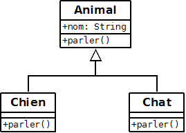

Quelques concepts à ne pas oublier :

* le polymorphisme traite de la capacité de l'objet à posséder plusieurs formes. 
* cette notion intervient sur les méthodes (et non sur les propriétés).
* une méthode possède une signature : un nom, un retour, des paramètres, et une visibilité

Il existe plusieurs façons de faire du polymorphisme :  

* par surcharge (overload)
* par redéfinition (override)
* par interface  

Ici, nous verrons l'overload et l'override.  

## La surcharge (overload)

La surcharge permet d'écrire plusieurs fois la même méthode avec le même nom. Elle s'écrit dans la même classe.  
Ce qui diffère est le nombre et le type d'arguments.  
On ré-écrit la méthode avec une signature différente.  
Elle permet à un objet d'avoir un comportement différent selon les paramètres passés.  

Code dans le package polymorphisme_simple.  

``` java
public class Oiseau {

    public Oiseau() {
    }

    public void voler() {
        this.voler("avec mes ailes");
    }

    public void voler(String complement) {
        System.out.println("je vole " + complement);

    }

    public void voler(int nombreCompagnon) {
        System.out.println("je décolle avec " + nombreCompagnon + " compagnons !!!!");
    }
}
```

``` Java
public class RunOverload {

    public static void main(String[] args) {
        Oiseau oiseau = new Oiseau();
        oiseau.voler("vite");
        oiseau.voler();
        oiseau.voler(3);
    }
}
```

## La redéfinition (override)

L'override est la réécriture de la méthode avec la même signature.  
Cette réécriture ne peut pas se faire dans la même classe.  
Elle est faisable dans la cas d'un héritage.  

Une classe parente possède une méthode.  
Nous redéfinissons la méthode avec la même signature dans une classe fille.  
Ce polymorphisme permet de spécialiser ou changer le comportement de la classe fille.  
Un bon IDE comme Eclipse indique que la méthode est en override : triangle vert.  
De plus il est conseillé de mettre l'annotation `@Override`.  



```Java
public class Animal {

    protected String nom;

    public Animal(String nom) {
        super(); // appel du constructeur parent Object
        this.nom = nom;
    }

    public void parler() {
        System.out.println("Je suis un animal");
    }
}
```

``` Java
public class Chien extends Animal {

    public Chien(String nom) {
        super(nom); // appel du constructeur parent
    }

    @Override
    public void parler() {
        System.out.println("je suis le chien " + this.nom + ", et je dis WOUF WOUF");
    }
}
```

``` Java
public class Chat extends Animal {

    public Chat(String nom) {
        super(nom); // appel du constructeur parent
    }

    @Override
    public void parler() {
        super.parler(); // appel de la methode du parent
        System.out.println("je suis le chat " + this.nom + ", et je dis MIAOU");
    }
}
```

``` Java
public class RunOverride {

    private static Animal personne, rex, felix;

    private static void faireParler(Animal animal) {
        animal.parler();
    }

    public static void main(String[] args) {
        personne = new Animal("Sans nom");
        rex = new Chien("Rex");
        felix = new Chat("Felix");

        faireParler(personne); // Je suis un animal
        faireParler(rex); // je suis le chien Rex, et je dis WOUF WOUF
        faireParler(felix); // Je suis un animal & je suis le chat Felix, et je dis MIAOU
    }
}
```
