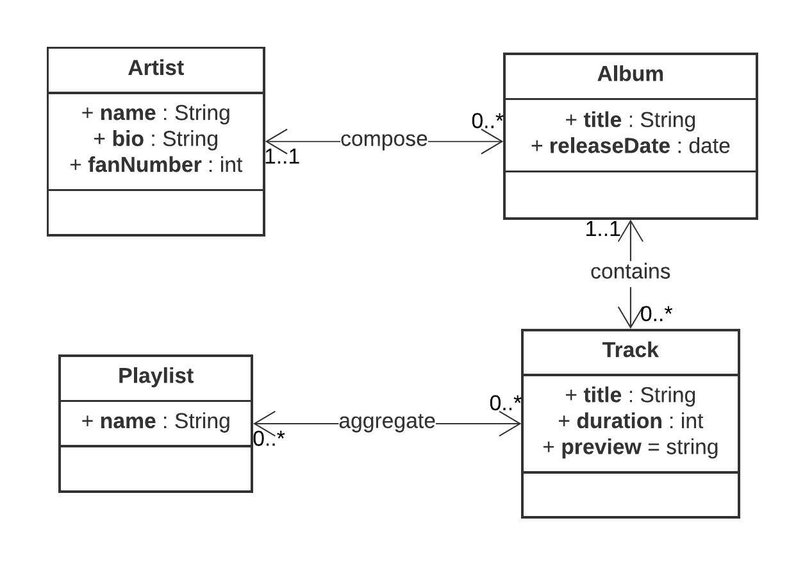
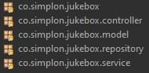
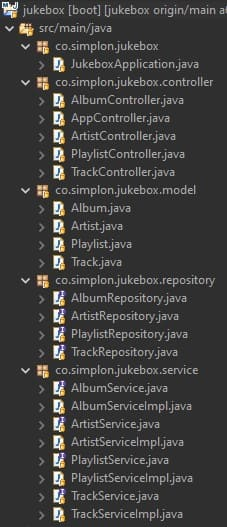
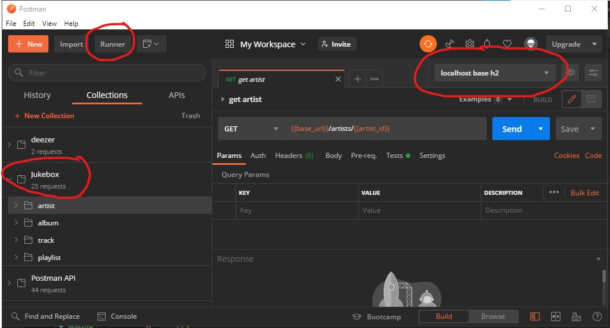

## Les quatre classes

Le projet permet la gestion de 4 classes.
Voici le diagramme des classes :

Nous avons quatre classes, deux relation OneToMany, et une relation ManyToMany.  
La relation ManyToMany entre Playlist et Track devrait donner naissance à une nouvelle classe, si nous voulions donner un ordre de lecture des tracks.
Ce n'est pas le choix que nous faisons.  

## Les temps

* Dans un premier temps, nous allons créer ces quatre classes sans lien entre elles et les exposer via des url.
* Nous ajoutons les relations entre les classes.
* Nous ajoutons le sérialisation vers JSON.
* La gestion des erreurs
* Les tests unitaires et d'intégration.
* La gestion des utilisateurs, identification et droits.

## Le github

Vous trouverez l'intégralité du projet sur le [github](https://github.com/Simplon-Webdev-Nantes-2020/jukebox) de la promo.

## Les points d'entrée de l'API

Nous allons écrire les quatre fonctions du CRUD.  
Pour cela, nous partons du projet précédent [jukebox simple CRUD](../../web/simpleCrud).  
Ne revenons pas sur la gestion de l'artiste. La gestion des 3 autres classes est identique.  
Ce qui donne 20 url pour artist, album, track, playlist :

* GET /jukebox/artists  
* GET /jukebox/artists/[id]  
* POST /jukebox/artists  
* PUT /jukebox/artists/[id]  
* DELETE /jukebox/artists/[id]  
* GET /jukebox/albums  
* GET /jukebox/albums/[id]  
* POST /jukebox/albums  
* PUT /jukebox/albums/[id]  
* DELETE /jukebox/albums/[id]  
* GET /jukebox/tracks  
* GET /jukebox/tracks/[id]  
* POST /jukebox/tracks  
* PUT /jukebox/tracks/[id]  
* DELETE /jukebox/tracks/[id]  
* GET /jukebox/playlists  
* GET /jukebox/playlists/[id]  
* POST /jukebox/playlists  
* PUT /jukebox/playlists/[id]  
* DELETE /jukebox/playlists/[id]  

## AOP

Avec la **Programmation Orienté Aspect**, chaque traitement est cloisonné.  
Donc pour chaque classe, nous avons un contrôleur, un service, un modèle et un repository.
Chacun de ces rôles est établit dans un package.  

Chaque package contient un nombre de classes.

## Tester le projet

Vous trouverez dans le repo github un dossier postman qui contient 2 fichiers :

* localhost base h2.postman_environment.json  
est l'environnement d'exécution
* Jukebox.postman_collection.json  
est la collection

Ces deux fichiers sont à importer dans Postman.
Pour exécuter une requête de la collection jukebox, il faudra dans un premier temps sélectionner l'environnement localhost base h2.  
Vous pourrez aussi, lancer toutes les requêtes à la suite avec le runner.  

