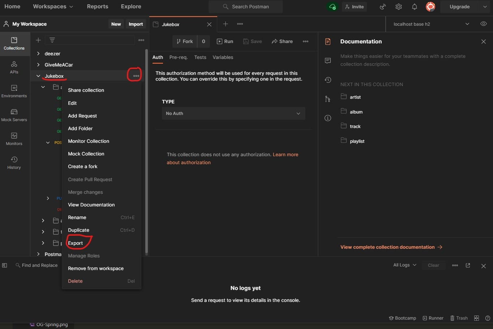

## Introduction

L'intégration est le fait d'assembler plusieurs composants élémentaires et donc d'en faire un nouveau composant de plus haut niveau.  
Partant de cette définition, un test d'intégration vise à s'assurer du bon fonctionnement de ce nouveau composant.
Il s'agit de vérifier que plusieurs unités de programme travaillant ensemble donnent le résultat attendu.  
Pour faire simple, un test d'intégration est un test unitaire sur un module complexe.
Nous allons alimenter ce module avec des données et vérifier le résultat.
Les tests d'intégration sont aussi de la responsabilité du développeur, mais contrairement aux tests unitaires, le développeur n'est pas le seul acteur.
Nous retrouvons ici le devOps qui sera responsable de la mise en place de l'intégration continue (CI).  
Dans une API Rest, un test d'intégration est le fait de tester une requête HTTP de bout en bout.
Attention ce n'est pas un test fonctionnel car il n'y a pas d'interface client.
Nous exécuterons les tests d'intégrations, lorsque tous les tests unitaires seront passés avec succès.  
Je vous encourage à (re)lire ce très bon article d'[Openclassroom](https://openclassrooms.com/fr/courses/6100311-testez-votre-code-java-pour-realiser-des-applications-de-qualite/6440061-choisissez-les-bons-tests-automatises-avec-la-pyramide-de-tests).

## Curl

Curl signifie Client URL. C'est un outil en ligne de commande souvent intégré par défaut au OS linux.
Il permet de récupérer le contenu de ressources à partir d'une URL.  
Nous pouvons aussi nous en servir pour écrire nos tests d'intégrations.  
S'il est très pratique, je préfère de loin Postman pour sa convivialité.

## Utilisons Postman

Postman est un outil incontournable pour tester une api rest.
Il existe une version plugin pour navigateur et une version client à installer sur son poste de dev.  
Postman est intuitif. On peut très facilement exécuter une requête et observer son résultat.  
Vérifier manuellement qu'une requête fonctionne et renvoie le résultat demandé, est en soit un test d'intégration.  
Le grand défaut de cette pratique est que ce n'est pas automatisé, donc non viable dans le temps.  
Nous allons donc automatiser ces tests.  
Pour cela nous allons :

* créer un environnement d'exécution
* écrire des requêtes en utilisant des variables
* écrire des tests
* et en option, écrire un scénario.

## Stratégie

Il faut est écrire nos tests d'intégration pour chaque requête http.  
Pour cela nous allons nous appuyer sur les exemples que nous fournit Postman ainsi que sur sa documentation.  
En fait ce n'est pas plus compliqué que les tests unitaires. Vous partez de la matrice GIVEN-WHEN-THAT.  
Comme il s'agit d'écrire des assertions, vous pouvez très bien vous dire que vous écrivez des tests unitaires pour une requête http.  
Lorsque vos tests sont écrits pour une requête http, vous exécutez la requête avec le bouton *send*.  
Lorsque de la création de votre requête, Postman vous a demandé de rattacher la requête à une collection.
Et bien, vous avez la possibilité de lancer toutes les requêtes d'une collection, il existe dans l'UI un bouton *run*.  
Aussi avant de pousser votre code sur github, je vous conseille de lancer votre batterie de tests. Ceci vous évitera les mauvaises surprises.

## Environnement

Un environnement Postman est un environnement d'exécution.
Il a les mêmes fonctions que tout environnement d'exécution :

* paramétrer son environnement
* permettre à l'application de s'exécuter dans différents contextes
* protéger son projet en mettant les données sensibles comme les mots de passe en paramètre (et non en dur)

La différence avec d'autres environnements est la notion de valeur courante.
C'est à dire qu'au cours de l'exécution de Postman, nous pouvons changer la valeur d'une variable. C'est sa valeur courante.
Et nous conservons toujours la valeur initiale.  
Nous pouvons créer autant d'environnements souhaités.  
Lorsque l'on demande à Postman d'exécuter les requêtes, on commence par sélectionner notre environnement.  

Voici un exemple d'environnement créé pour le projet :


Et sa traduction en json :

```json
{
    "id": "c240247b-4cff-4261-ac0d-1b7e7252d120",
    "name": "localhost base h2",
    "values": [
        {
            "key": "base_url",
            "value": "localhost:8080/jukebox",
            "enabled": true
        },
        {
            "key": "artist_id",
            "value": "1",
            "enabled": true
        },
        {
            "key": "new_artist_id",
            "value": "8",
            "enabled": true
        },
        {
            "key": "album_id",
            "value": "2",
            "enabled": true
        },
        {
            "key": "new_album_id",
            "value": "4",
            "enabled": true
        },
        {
            "key": "track_id",
            "value": "3",
            "enabled": true
        },
        {
            "key": "new_track_id",
            "value": "25",
            "enabled": true
        },
        {
            "key": "playlist_id",
            "value": "1",
            "enabled": true
        },
        {
            "key": "new_playlist_id",
            "value": "3",
            "enabled": true
        }
    ],
    "_postman_variable_scope": "environment",
    "_postman_exported_at": "2020-11-27T15:24:19.777Z",
    "_postman_exported_using": "Postman/7.36.0"
}
```

## Écritures des requêtes

Nous faisons des GET/POST/PUT/DELETE, en renseignant l'url et le body.
Ce qui change, est l'utilisation de variables, reconnaissable par les moustaches {{ }}.

### Une requête GET


Et sa traduction en json :

```json
"request": {
    "method": "GET",
    "header": [],
    "url": {
        "raw": "{{base_url}}/artists/{{artist_id}}",
        "host": [
            "{{base_url}}"
        ],
        "path": [
            "artists",
            "{{artist_id}}"
        ]
    }
}
```

### Une requête POST


Et sa traduction en json :

```json
"request": {
    "method": "POST",
    "header": [
        {
            "key": "Content-Type",
            "value": "application/json"
        }
    ],
    "body": {
        "mode": "raw",
        "raw": "{\n    \"id\": 0,\n    \"name\": \"AC/DC\",\n    \"bio\": \"La famille Young quitte Glasgow en Ecosse et émigre à Sydney en Australie en 1963. Le fils cadet de sept frères George, guitariste et auteur compositeur y fonde The Easybeats avec le Hollandais Harry Vanda....\",\n    \"fanNumber\": 7252046\n}",
        "options": {
            "raw": {}
        }
    },
    "url": {
        "raw": "{{base_url}}/artists",
        "host": [
            "{{base_url}}"
        ],
        "path": [
            "artists"
        ]
    }
}
```

## Écriture des tests

Les tests sont exécutés au retour de la requête. Ils permettent de vérifier le résultat attendu.
Ils sont écrits en js avec la librairie d'assertion *chai*.
*chai* permet l'écriture de tests unitaires d'une application js.
Le fait d'utiliser des variables d'environnement permet de faire des tests plus complexes, ainsi que des scénarios.  
Pour récupérer une variable d'environnement, on utilise la commande `pm.environment.get`.
On utilise la commande `pm.environment.set` pour la mise à jour.  
Voici un exemple de test vérifiant la réponse d'un GET artist


Et sa traduction en json :

```json
"script": {
    "id": "d3714843-3a8c-48e9-a1e2-8e9df8f9f5d1",
    "exec": [
        "pm.test(\"response json should contain one collection\", function () {\r",
        "    pm.expect(pm.response.json()).to.have.property('id');\r",
        "    pm.expect(pm.response.json()).to.have.property('name');\r",
        "    pm.expect(pm.response.json()).to.have.property('bio');\r",
        "    pm.expect(pm.response.json()).to.have.property('fanNumber');\r",
        "});\r",
        "\r",
        "pm.test(\"test id\", function () {\r",
        "    var jsonData = pm.response.json();\r",
        "    pm.expect(jsonData.id).greaterThan(0);\r",
        "});\r",
        "\r",
        "if (pm.environment.get(\"artist_id\") == 1)\r",
        "    pm.test(\"test values\", function () {\r",
        "        var jsonData = pm.response.json();\r",
        "        pm.expect(jsonData.id).eql(1);\r",
        "        pm.expect(jsonData.name).eql('Celtic woman');\r",
        "        pm.expect(jsonData.bio).not.eql(null);\r",
        "        pm.expect(jsonData.fanNumber).eql(31760);\r",
        "    });\r",
        ""
    ],
    "type": "text/javascript"
}

```

## Le scénario

Un scénario est une suite de tests exécutés dans un ordre précis. Un scénario va simuler le comportement d'un utilisateur final.  
On pourrait être tenté de parler de test fonctionnel, cependant dans Postman, il n'y a pas d'UI.  
Un scénario va permettre de consolider votre batterie de tests, en donnant en sens à vos tests.  
Par exemple, on va tester la création d'un artiste, puis la création de son album, ensuite la lecture de ses albums et pour finir la suppression de l'artiste.

## Export des tests

Avec Postman, vous pouvez exportez vos collections en format json et ainsi les versionner dans git.  
Vous retrouverez cette collection dans ce [repo github](https://github.com/Simplon-Webdev-Nantes-2020/jukebox/tree/main/postman).


