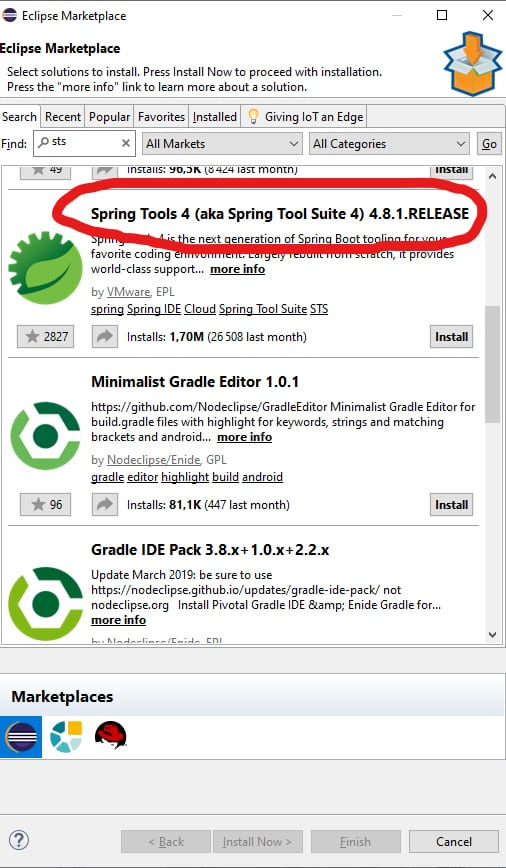

## Qu'est-ce que Spring et SpringBoot

SpringBoot est une extension Spring. Il fut créé pour simplifier Spring.  
Dans cette formation, nous étudions SpringBoot.  

### Spring

Spring est un framework Java open source qui facilite et structure le développement d'applications java. Créé par Rod Jonhson, il est aujourd'hui porté par la société Pivotal.
Il est né de l'idée de fournir une solution plus simple que Java EE (Java EE est la plateforme proposée par Sun pour développer des applications professionnelles).
Initialement dénommé Spring Framework, il est utilisé dans de nombreux projets depuis de nombreuses années.
Au fils du temps, il a évolué pour fournir toujours plus de services et permettre aux développeurs de travailler plus vite, plus facilement et de manière plus structurée.  
Spring Framework 3.0 est composé d'une vingtaine de modules regroupées en plusieurs parties: Spring Core, AOP, Data Access, Web, Test.  
Spring est un framework extrêmement puissant, proposant des services très intéressants mais il un a très un gros défaut : il est difficile à configurer.
Pour écrire du code avec Spring, il faut à la fois écrire du code java, mais aussi écrire dans des fichiers de configuration XML ou properties.
Ceci amène une grande complexité aussi bien de compréhension du code que de maintenance de ce dernier.

### SpringBoot

Pour pallier cette complexité les développeurs de Spring ont décidé de réécrire Spring. Spring est devenu SpringBoot.  
Ils sont parti sur le concept de "Convention over Configuration".
Le but de ce concept est de réduire le nombre de décisions du développeur et donc la complexité du produit qu'il développe.  
SpringBoot fournit :

* une configuration par défaut pour les projets Spring.
* un site qui centralise les ressources : [start.spring.io](https://start.spring.io/).
* un assistant intégré dans Eclipse : STS (Spring Tool Suite).
* une intégration forte du serveur d'application Web. Tomcat est embarqué dans SpringBoot.
* un recours massif aux annotations, pour éviter les fichiers de configurations.
* l'encapsulation d'un grand nombre de librairie java.
* un cadre de bonnes pratiques : test, MVC...

Par ailleurs, SpringBoot est particulièrement efficace dans la création d'API Rest (ou RestFull), et les micro services.

### Les Concepts fondateurs

Spring s'appuie sur 3 concepts : l'**inversion de contrôle** (IOC), la **programmation orienté aspect** (POA), une **couche d'abstraction**.  
L'IOC gère les dépendances entre les classes par une déclaration.  
L'IOC gère les dépendances entre les classes par une déclaration.  
La POA sépare la couche métier (coeur du logiciel), de la couche technique.  
La couche d'abstraction permet d'intégrer facilement d'autres frameworks ou bibliothèques. On utilise pour cela l'outil Maven ou Gradle.

## Outils à disposition

Pour développer, vous devez utiliser un EDI. Eclipse ou Intellij IDEA sont très bien.  
VS Code a fait d'énormes projets ces derniers temps, si bien qu'on peut aujourd'hui dire que c'est un EDI.

### Eclipse

C'est cet environnement qui est utilisé dans la suite du tuto.  
Installez, le plugin STS. C'est un plugin qui ajoute une perspective dédiée à la création et la gestion d'application SpringBoot.  
Pour l'installer, rendez-vous sur le marketplace et rechercher STS et suivez les instructions.

### VS Code

Installez 4 plugins Spring.

#### Spring initializr Java Support

#### Spring Boot Dashboard

#### Spring Boot Tools

#### Spring Boot Snippets

