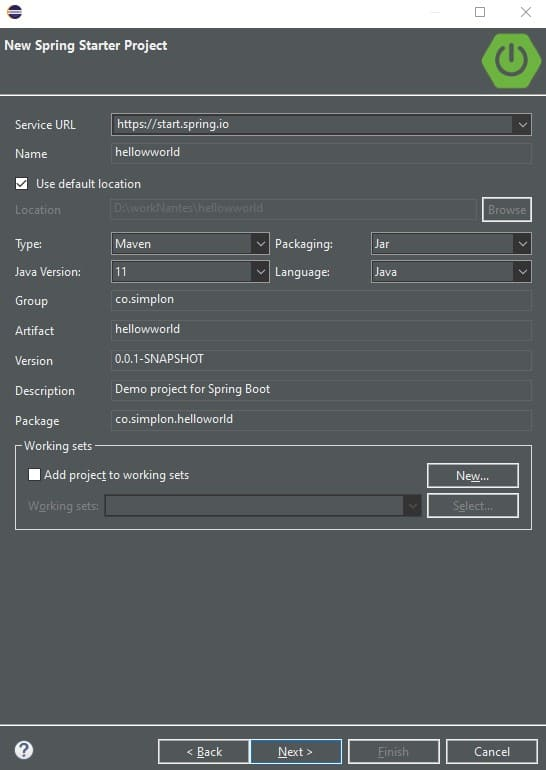
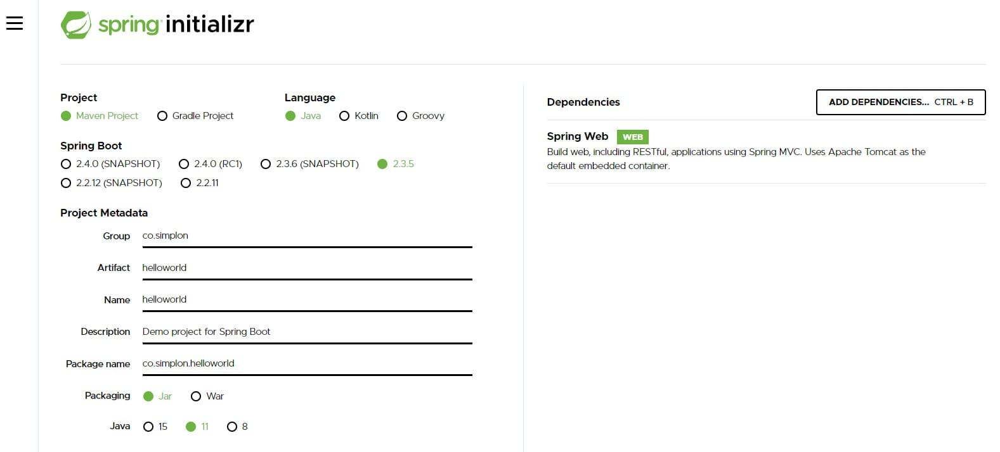

**Hello World** est la première page que l'on affiche lorsque l'on crée un site Web.  
Dans ce chapitre, nous allons créer from scratch une application web avec SpringBoot.

## Création du projet SpringBoot

Vous pouvez créer un projet Spring soit à partir du site Web, soit à partir de l'IDE.

### Création du projet à partir d'Eclipse

Dans la perspective Spring, créer un nouveau projet SpringBoot en passant par New \ Spring Boot Starter Project.

Dans la fenêtre de création qui s'affiche, renseignez les informations de votre projet en veillant à conserver comme Service URL "http://start.spring.io", comme type "Maven" et Java Version "11" et cliquez sur Next.



Ensuite, ajoutez "Spring Web" dans les dépendances du projet. Cliquez sur Finish.


### Création du projet à partir du site start.spring.io

Allez sur le site [start.spring.io](https://start.spring.io) et renseigner les champs. Sélectionner la dépendance Spring Web.



Puis :

1. Générer le projet
1. Dézipper le fichier téléchargé dans votre workspace
1. Dans Eclipse, importez un projet Maven

### Création du projet à partir de VS Code

1. Ouvrir le panneau de commande (ctrl+shift+p)
1. Renseigner les informations
1. Le projet est généré dans le dossier de votre choix
1. Si vous avez une incompatibilité de version de Java, ouvrez pom.xml et changez la valeur de `java.version`.

## Un peu de code

Vous ouvrez le projet dans votre EDI, et vous découvrez un projet Maven.
Positionnez vous dans le dossier src/main/co/simplon/helloworld (au même niveau que le fichier HellowworldApplication.java)

### la page home

Vous allez ajoutez une nouvelle classe. Ce sera un controller qui renverra le message "Hello World". Nous verrons par la suite la définition du controller.  
Ajoutez la classe HomeController (new class).  

```java
package co.simplon.helloworld;

import org.springframework.stereotype.Controller;
import org.springframework.web.bind.annotation.RequestMapping;
import org.springframework.web.bind.annotation.ResponseBody;

@Controller
public class HomeController {
    @RequestMapping("/")
    @ResponseBody
    public String hello()
    {
        return "Hello World";
    }
}
```

### Lancement du serveur

Pour lancer une application SpringBoot, il suffit simplement de faire un clique droit sur le projet, et lancer **Run as... \ Spring Boot App**.  
On peut suivre le lancement du serveur dont le log s'affiche automatiquement dans la console :

```log

  .   ____          _            __ _ _
 /\\ / ___'_ __ _ _(_)_ __  __ _ \ \ \ \
( ( )\___ | '_ | '_| | '_ \/ _` | \ \ \ \
 \\/  ___)| |_)| | | | | || (_| |  ) ) ) )
  '  |____| .__|_| |_|_| |_\__, | / / / /
 =========|_|==============|___/=/_/_/_/
 :: Spring Boot ::        (v2.3.5.RELEASE)

2020-11-06 18:07:54.182  INFO 9240 --- [           main] c.s.helloworld.HellowworldApplication    : Starting HellowworldApplication on LAPTOP-MANU with PID 9240 (D:\workNantes\hellowworld\target\classes started by Simplon in D:\workNantes\hellowworld)
2020-11-06 18:07:54.184  INFO 9240 --- [           main] c.s.helloworld.HellowworldApplication    : No active profile set, falling back to default profiles: default
2020-11-06 18:07:55.079  INFO 9240 --- [           main] o.s.b.w.embedded.tomcat.TomcatWebServer  : Tomcat initialized with port(s): 8080 (http)
2020-11-06 18:07:55.095  INFO 9240 --- [           main] o.apache.catalina.core.StandardService   : Starting service [Tomcat]
2020-11-06 18:07:55.095  INFO 9240 --- [           main] org.apache.catalina.core.StandardEngine  : Starting Servlet engine: [Apache Tomcat/9.0.39]
2020-11-06 18:07:55.187  INFO 9240 --- [           main] o.a.c.c.C.[Tomcat].[localhost].[/]       : Initializing Spring embedded WebApplicationContext
2020-11-06 18:07:55.187  INFO 9240 --- [           main] w.s.c.ServletWebServerApplicationContext : Root WebApplicationContext: initialization completed in 940 ms
2020-11-06 18:07:55.413  INFO 9240 --- [           main] o.s.s.concurrent.ThreadPoolTaskExecutor  : Initializing ExecutorService 'applicationTaskExecutor'
2020-11-06 18:07:55.608  INFO 9240 --- [           main] o.s.b.w.embedded.tomcat.TomcatWebServer  : Tomcat started on port(s): 8080 (http) with context path ''
2020-11-06 18:07:55.623  INFO 9240 --- [           main] c.s.helloworld.HellowworldApplication    : Started HellowworldApplication in 1.785 seconds (JVM running for 3.425)
```

Enfin, rendez-vous dans votre navigateur préféré à l'adresse : http://localhost:8080.  
Celui-ci vous affichera alors "Hello World".  
Vous venez de créer votre premier serveur Web. Celui-ci peut être déployé sur le Web.  

---

## Behind the scene

### La structure d'un projet Spring Boot

SpringBoot apporte aux développeurs une structuration forte pour leurs projets.
En plus d'être une bonne pratique, ceci est important pour Spring qui parcourt ces répertoires pour gérer le code source (identifications des classes "spéciales", injection de classes...), les ressources...  
En parcourant notre projet SpringBoot, on peut déjà observer que les répertoires suivants ont été créés :

* **src/main/java** : répertoire racine pour le code source de notre application
* **src/main/resources** : répertoire racine pour les ressources pour notre application
* **src/main/resources/static** : répertoire pour les ressources statiques à déployer(fichiers html, css...)
* **src/test/java** : repertoire destiné à recevoir les tests (junit...)
* **target** : repertoire dans lequel Maven génère le code compilé

En plus de ces répertoires, des fichiers de configurations essentiel au bon fonctionnement de notre projet ont été générés.  
Comme SpringBoot est basé sur le concept de **Convention over Configuration**, il est dangereux de modifier cette structure.

### pom.xml

Ce fichier présent à la racine du projet est un fichier xml utilisé pour le pilotage de Maven. On y trouve :

* des élements d'identifications de notre projet (méta informations)
* la configuration Spring Boot (package, version...)
* les propriétés pour le projet (version java, encodage...)
* les dépendances vers les librairies utiles au projet

et d'autres informations qu'il est plus rare d'avoir à configurer.  

#### Bloc d'identification

```xml
<groupId>co.simplon</groupId>
<artifactId>hellowworld</artifactId>
<version>0.0.1-SNAPSHOT</version>
<name>hellowworld</name>
<description>Demo project for Spring Boot</description>
```

#### Bloc SpringBoot

```xml
<parent>
    <groupId>org.springframework.boot</groupId>
    <artifactId>spring-boot-starter-parent</artifactId>
    <version>2.3.5.RELEASE</version>
    <relativePath/> <!-- lookup parent from repository -->
</parent>
```

#### Bloc de propriétés du projet

```xml
<properties>
    <java.version>11</java.version>
</properties>
```

#### Bloc de dépendances

```xml
<dependencies>
    <dependency>
        <groupId>org.springframework.boot</groupId>
        <artifactId>spring-boot-starter-web</artifactId>
    </dependency>

    <dependency>
        <groupId>org.springframework.boot</groupId>
        <artifactId>spring-boot-starter-test</artifactId>
        <scope>test</scope>
        <exclusions>
            <exclusion>
                <groupId>org.junit.vintage</groupId>
                <artifactId>junit-vintage-engine</artifactId>
            </exclusion>
        </exclusions>
    </dependency>
</dependencies>
```

C'est grâce à ce fichier que le projet java sera configuré et que l'ensemble des librairies utiles seront téléchargées et intégrées au projet Java.

### application.properties

Il s'agit d'un fichier de propriété java classique (clés/valeurs).
Ce fichier a vocation à contenir **TOUTES** les informations de configuration des composants utilisés par le projet (composants encapsulés par SpringBoot).

Pour plus de détails sur les mots clefs utilisables, lisez la doc de Spring : [docs.spring.io](https://docs.spring.io/spring-boot/docs/current/reference/html/common-application-properties.html).

### la classe de lancement SpringBoot

Il s'agit de la classe java qui servira de point d'entrée pour notre application.  
Dans un projet Java classique, on pourrait la comparer avec la classe portant la méthode main.  
Attention ! ne déplacez jamais cette classe.

```java
package co.simplon.helloworld;

import org.springframework.boot.SpringApplication;
import org.springframework.boot.autoconfigure.SpringBootApplication;

@SpringBootApplication
public class HellowworldApplication {

    public static void main(String[] args) {
        SpringApplication.run(HellowworldApplication.class, args);
    }

}

```

On remarque que la classe qui a été générée est surmontée d'une annotation **@SpringBootApplication**.  
Cette annotation va permettre à Spring de savoir que c'est cette classe qu'il faut utiliser comme point d'entrée lors du lancement de notre application.

### le controller

Dans le monde Spring, le mot 'Controller' désigne la classe qui fournit les services web (équivalent des Servlet en Java Web).  
Pour définir un 'Controller' au sens Spring, on va ajouter à la classe précédemment créée l'annotations **@Controller**.  
Grâce à cette annotation, Spring identifiera cette classe comme une classe 'spéciale' sur laquelle il travaillera.  
La méthode hello renvoie la chaîne de caractère "Helloworld".  
Pour relier cette méthode à une URI, on va ajouter à la déclaration de la méthode l'annotation **@RequestMapping(***chemin***).** (chemin étant la chaîne de caractère qui sera ajoutée à la fin de l'URL).  
Comme notre méthode retourne un variable (ici une chaîne de caractères), il faut aussi ajouter l'annotation **@ResponseBody**.

```java
package co.simplon.helloworld;

import org.springframework.stereotype.Controller;
import org.springframework.web.bind.annotation.PathVariable;
import org.springframework.web.bind.annotation.RequestMapping;
import org.springframework.web.bind.annotation.ResponseBody;

@Controller
@RequestMapping("/bienvenue")
public class MessageController {

    @RequestMapping("")
    @ResponseBody
    public String hello()
    {
        return "Bienvenue tout le monde";
    }

    @RequestMapping("/{phrase}")
    @ResponseBody
    public String afficherMessage(@PathVariable("phrase") String phrase)
    {
        return "Bienvenue " + phrase;
    }

}

```
