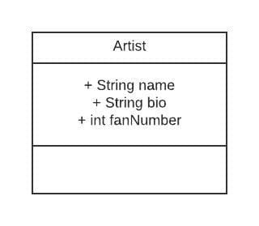

## Les données

Pour étudier Spring, nous allons commencer par écrire un petit projet.
Nous allons gérer un jukebox. Le jukebox contient des artistes, des albums et des titres.  
Vous pouvez consulter les sources du projet sur [github](https://github.com/Simplon-Webdev-Nantes-2020/jukebox).  
Nous commençons par écrire l'API pour gérer une table, la table artiste.
Nous pouvons créer un enregistrement, le lire, le modifier, et le supprimer (CRUD).



## Mise en place du CRUD pour artiste

Ce projet met à disposition l'API suivante :

* GET /jukebox/artists  
liste les informations de l'ensemble des enregistrements Artiste.  
* GET /jukebox/artists/[id]  
renvoie les informations d'un enregistrement Artiste.  
* POST /jukebox/artists  
crée un nouvel enregistrement Artiste avec les informations fournies.  
* PUT /jukebox/artists/[id]  
met à jour l'enregistrement Artiste correspondant à l'id fourni avec les informations fournies.  
* DELETE /jukebox/artists/[id]  
supprime l'enregistrement Artiste correspondant à l'id fourni.

## Compilation et exécution

Dans la suite du projet, vous utilisez Eclipse pour compiler et exécuter.
Vous pouvez aussi le faire en ligne de commande dans le dossier racine du projet :  
`mvnw clean install` pour compiler.  
`mvnw spring-boot:run` pour lancer le projet.

## Le rôle de chaque classe

Pour écrire une API Rest, vous devez créer quatre packages :

* artiste.model pour l'entité
* artiste.repository pour le lien avec la base de données
* artiste.service pour la couche métier
* artiste.controller pour le contrôleur

Un package ne contient en général une seule classe.  

Chaque package est associé à un rôle.
Si vous devez gérer une autre entité, vous créerez 4 autres package (album.model, album.repository, album.service, album.controller).  
Le modèle MVC sépare le code en 3 responsabilités.
Lorsque l'on écrit une api rest, la vue est tronquée car celle-ci est gérée par une autre application.
Donc dans une API rest, la vue c'est la donnée envoyée au format JSON.
Spring fait cette action à notre place.  
Reste le contrôleur et le modèle.
Le modèle, c'est l"entité décrite dans la package model.
A ce package, s'ajoute le package repository.  
Le contrôleur, c'est le package controller, associé au package service.  
Allons vite voir cela en détail.

## Le modèle

C'est l'entité Artist. Nous avons donc une classe contenant tous les attributs de l'artiste :  

```java
@Entity
public class Artist {

    @Id
    @GeneratedValue(strategy = GenerationType.AUTO)
    private long id;

    @NotBlank(message = "Name can't be empty")
    private String name;

    private String bio;

    private Integer fanNumber;

    public long getId() {
        return id;
    }
    public void setId(long id) {
        this.id = id;
    }
    public String getName() {
        return name;
    }
    public void setName(String name) {
        this.name = name;
    }
    public String getBio() {
        return bio;
    }
    public void setBio(String bio) {
        this.bio = bio;
    }
    public Integer getFanNumber() {
        return fanNumber;
    }
    public void setFanNumber(Integer fanNumber) {
        this.fanNumber = fanNumber;
    }
}
```

La visibilité des attributs est privée, et nous utilisons les getter/setter pour accéder à leur valeur.  
C'est ici que ce fait le mapping entre la classe @Entity et la base de données.
La classe Artist est reliée à la table artiste de la base de données, et les attributs deviennent des champs.
Tout champ écrit en camel case est traduit en snake case.  
Nous notons aussi des annotations : @Entity, @Id, @NotBlank.

* [@Entity](/docs/spring/parametrage/annotation/#annotations_sur_l_entit) indique à Spring qu'il s'agit d'une entité (un modèle).
* [@id](/docs/spring/parametrage/annotation/#annotation_sur_les_champs) identifie la clef primaire.
* [@GeneratedValue](/docs/spring/parametrage/annotation/#annotation_sur_les_champs) indique que la clef primaire est calculée.  
`(strategy = GenerationType.AUTO)` indique que la valeur est auto-incrémentée.
* [@NotBlank](/docs/spring/parametrage/annotation/#annotation_sur_les_champs) peut être mis sur chaque attribut. Il signifie que la valeur ne pas pas être nulle.  
`(message = "Name can't be empty")` est le message renvoyé si le client voulait valider cet enregistrement avec une valeur interdite.

## Un petit test de vérification

Après avoir créer votre projet avec Initializr et créer votre Entity, il est intéressant de tester votre site et vérifier qu'il répond à une requête simple.  
Pour cela, on crée le contrôleur et ajouter une méthode de test.

```java
@RestController
@RequestMapping("/jukebox")
public class ArtistController {

    @CrossOrigin
    @GetMapping("/artist/hello")
    ResponseEntity<Artist> getArtistToto() {
        Artist hello = new Artist();
        hello.setName("Hello");
        hello.setBio("Comment allez-vous ?");
        hello.setFanNumber(100);
        return ResponseEntity.ok().body(hello);
    }
}
```

Nous reviendrons sur les annotations.

## La persistance de données

Cette classe est responsable de la persistance. C'est elle qui lit et écrit les enregistrements de la base de données et renseigne le modèle.
Cette classe est étrangement vide, et d'ailleurs c'est une interface.  

```java
public interface ArtistRepository extends JpaRepository<Artist, Long>{
    public List<Artist> findByNameContaining(String name) ;
}
```

Aussi étrange que cela puisse paraître, c'est ici que sont générées les requêtes SQL.  
Nous savons que c'est le repository du modèle Artist grace au type générique (diamant) de JpaRepository.  
C'est la magie de Spring que nous étudierons plus tard.  
Nous voyons son utilisation dans le service.

## Le service

Nous créons une interface et son implémentation :

```java
public interface ArtistService {
    Optional<Artist> findById(Long id);
    List<Artist> findAll(String search);
    Artist insert(Artist artist);
    Artist update(Long id, Artist artist);
    void delete(Long id);
}
```

```java
@Service
public class ArtistServiceImpl implements ArtistService {

    @Autowired
    private ArtistRepository repository;

    @Override
    public List<Artist> findAll(String search) {
        ...
    }

    @Override
    public Optional<Artist> findById (Long id) {
        ...
    }

    @Override
    public Artist insert(Artist artist) {
        ...
    }

    @Override
    public Artist update(Long id, Artist artist) {
        ...
    }

    @Override
    public void delete(Long id) {
        ...
    }

}
```

Le service contient la couche métier, c'est ici qu'est écrit le code le plus complexe.
Nous pouvons avoir à gérer plusieurs modèles. Nous y reviendrons.  
Dans notre cas le code se résume à un appel du modèle.
D'abord étudions les annotations, puis regardons chaque méthode.

### Annotations du service

* [@Service](/docs/spring/parametrage/annotation/#component_repository_service) indique que c'est un service
* [@Autowired](/docs/spring/parametrage/annotation/#autowired_ou_inject) indique que nous utilisons le modèle Artiste et plus précisément l'interface ArtistRepository. C'est une injection, donc c'est Spring qui s'occupe de l'instanciation.

### findALL

```java
    public List<Artist> findAll(String search) {
        if (! "".equals(search))
            return repository.findByNameContaining(search);
        else
            return repository.findAll();
    }
```

Cette méthode retourne tous les artistes sous forme de liste.
Quand le paramètre search est vide, elle appelle la méthode findall() de ArtistRepository.
Or cette méthode n'est pas déclarée.
En fait ArtistRepository hérite de JpaRepository.
Grace à un système d'injection de dépendance (DI), Spring trouve dans son architecture la bonne classe qui est capable d'exécuter la requête SQL.  
Quand le paramètre search est renseigné, elle appelle la méthode findByNameContaining(search).
Cette méthode est déclarée mais pas implémentée. Spring a prévu pour nous cette situation et donc possède dans ses réserves du code pour exécuter la requête `SQL select ... where artist.name like ...`.

### findById

```java
@Override
public Optional<Artist> findById (Long id) {
    return repository.findById(id);
}
```

Cette méthode retourne un objet Optional. C'est assez récent dans l'histoire de Spring.
Vous trouverez beaucoup d'exemples sur le web où findById renvoie le modèle (Artist).  
Le type Optional est expliqué dans le contrôleur.

### insert

```java
public Artist insert(Artist artist) {
    return repository.save(artist);
}

```

Insert crée un enregistrement dans la base, et renvoie un artiste.
En effet, nous avons besoin de connaître son nouvel id.  
Elle appelle la méthode save() du modèle.

### update

```java
public Artist update(Long id, Artist artist) {

    Optional<Artist> optionalArtist = this.findById(id);

    if(optionalArtist.isPresent()) {

        Artist artistToUpdate = optionalArtist.get();
        artistToUpdate.setName(artist.getName());
        if (artist.getBio() != null)
            artistToUpdate.setBio(artist.getBio());
        if (artist.getFanNumber() != null)
            artistToUpdate.setFanNumber(artist.getFanNumber());
        return repository.save(artistToUpdate);
    }

    return null;
}
```

Update met à jour l'artiste, mais uniquement les champs qui sont renseignés (not null).
Elle renvoie l'artiste modifié.
Elle appelle les méthodes save() et findById() du modèle.

### delete

```java
public void delete(Long id) {
    Optional<Artist> artist = this.findById(id);
    if (artist.isPresent()) {
        repository.delete(artist.get());
    }
}
```

Cette méthode supprime un artiste s'il est présent.
Pour cela, nous vérifions sa présence.
Elle appelle la méthode delete() du modèle.

## Le contrôleur

Ici nous sommes au niveau de l'URL, c'est à dire le I (Interface) de l'API.
C'est une API Rest (appellée aussi restFull), la ressource est la donnée que nous partageons avec le client.
Ici la resource est identifiée par l'URL, et c'est l'id qui différencie chaque resource.

```java
@RestController
@RequestMapping("/jukebox")
public class ArtistController {

    @Autowired
    ArtistService service;

    @CrossOrigin
    @GetMapping("/artists")
    public ResponseEntity<List<Artist>> getAllArtist(@RequestParam(value="search", defaultValue="") String search) {
        ...
    }

    @CrossOrigin
    @GetMapping("/artists/{id}")
    ResponseEntity<Artist> getArtistById(@PathVariable(value="id") long id) {
        ...
    }

    @CrossOrigin
    @PostMapping("/artists")
     ResponseEntity<Artist> addArtist(@Valid @RequestBody Artist artist){
        ...
    }

    @CrossOrigin
    @PutMapping("/artists/{id}")
    ResponseEntity<Artist> updateArtiste(@PathVariable(value="id") long id, @Valid @RequestBody Artist artist){
        ...
    }

    @CrossOrigin
    @DeleteMapping("/artists/{id}")
    ResponseEntity<Artist> deleteArtist(@PathVariable(value="id") long id){
        ...
    }

}
```

### Annotations du contrôleur

Vous retrouverez les explications dans cet [article](/docs/spring/parametrage/annotation/#la_gestion_des_url) du blog.

* `@RestController`  
indique que c'est une contrôleur
* `@RequestMapping("/jukebox")`  
Contrôleur que s'accupe de toutes les url commençant par /jukebox
* `@Autowired`  
injection du service
* `@CrossOrigin`  
permet d'avoir un serveur api et un serveur nodejs pour l'UI.
* `@GetMapping`  
URL avec le verbe GET
* `@PostMapping`  
URL avec le verbe POST
* `@PutMapping`  
URL avec le verbe PUT
* `@DeleteMapping`  
URL avec le verbe DELETE

* `@RequestParam`  
récupère un paramètre dans l'URL après le endpoint (séparateur ?)
* `@PathVariable`  
récupère un paramètre dans l'URL (path)
* `@RequestBody`  
récupère les infos dans le body
* `@Valid`  
Indique que l'on contrôle la validité des informations envoyées

### GET /artists

```java
@GetMapping("/artists")
public ResponseEntity<List<Artist>> getAllArtist(@RequestParam(value="search", defaultValue="") String search) {
    List<Artist> listArtist;
    try {
        listArtist = service.findAll(search);
    } catch (Exception e) {
        return ResponseEntity.notFound().build();
    }
    return ResponseEntity.ok().body(listArtist);
}
```

Cette méthode traite une requête `/jukebox/artists?search=qque chose` avec le verbe GET.
Elle récupère le paramètre search (`@RequestParam`), et retourne une réponse dans le body : `ResponseEntity.ok().body()`.
Cette réponse est une liste d'artistes.
S'il n'y a pas d'erreur, nous renvoyons le code 200 (.ok()), sinon l'erreur 404 (.notFound()).

### GET /artists/{id}

```java
@GetMapping("/artists/{id}")
ResponseEntity<Artist> getArtistById(@PathVariable(value="id") long id) {
    Optional<Artist> artist = service.findById(id);
    if (artist.isEmpty()) {
        return ResponseEntity.notFound().build();
    }
    return ResponseEntity.ok().body(artist.get());
}
```

Cette méthode traite une requête `/jukebox/artists/xxx` avec le verbe GET.
Elle récupère le paramètre dans l'url (`@PathVariable`), et retourne une réponse dans le body : `ResponseEntity.ok().body()`.
Le type Optional contient un objet Artist, il évite le `nullPointerException`.

### POST /artists

```java
@PostMapping("/artists")
    ResponseEntity<Artist> addArtist(@Valid @RequestBody Artist artist){
        return ResponseEntity.ok().body(artist);
    }
```

Cette méthode traite une requête `/jukebox/artists` avec le verbe POST.
POST est une création de la ressource (Dans un blog, on POSTe un article).
L'artiste est dans le body (`@RequestBody`).
`@Valid` indique que nous allons vérifier toutes les contraintes sur les attributs (@NotNull, @NotBlank) du modèle.
S'il y a erreur, la création est ineffective.  
Nous faisons une petite transgression sur le code réponse. Nous devrions retourner le code 201.

### PUT /artists

```java
@PutMapping("/artists/{id}")
    ResponseEntity<Artist> updateArtiste(@PathVariable(value="id") long id, @Valid @RequestBody Artist artist){
        Artist updatedArtiste = service.update(id, artist);
        if(updatedArtiste == null)
            return ResponseEntity.notFound().build();

        return ResponseEntity.ok().body(updatedArtiste);
    }
```

Cette méthode traite une requête `/jukebox/artists/xxx` avec le verbe PUT.
PUT est un écrasement de la ressource.
C'est pour cette raison que l'id est dans le path.
L'artiste est dans le body (`@RequestBody`).
`@Valid` indique que nous allons vérifier toutes les contraintes sur les attributs (@NotNull, @NotBlank) du modèle.
S'il y a erreur, la mise à jour est ineffective.

### DELETE /artists

```java
@DeleteMapping("/artists/{id}")
ResponseEntity<Artist> deleteArtist(@PathVariable(value="id") long id){
    Optional<Artist> artist = service.findById(id);
    if(artist.isEmpty())
        return ResponseEntity.notFound().build();

    service.delete(artist.get().getId());
    return ResponseEntity.accepted().build();
}
```

Cette méthode traite une requête `/jukebox/artists/xxx` avec le verbe DELETE.
DELETE supprime la ressource.
Nous avons besoin uniquement de l'id qui est dans le path (`@PathVariable`).

## Les ressources

Ce sont les ressources nécessaires au bon fonctionnement du serveur.  
Tout ce projet ne peut fonctionner sans paramétrage et ressources.
Les ressources sont dans le dossier src/main/ressource.  
Il peut avoir un dossier ressource côté test qui servira pour l'exécution des tests unitaires.

### les properties

Le paramétrage se décrit dans le fichier  application.properties.

#### Connection à la base de données

Spring se comporte comme un client vis à vis de la base de données.
Il lui faut donc une connection.
C'est ce que nous déclarons dans le fichier application.properties

```ini
spring.datasource.url=jdbc:h2:mem:jukebox
spring.datasource.username=sa
spring.datasource.password=
spring.datasource.driver-class-name=org.h2.Driver
spring.datasource.platform=h2
spring.h2.console.enabled=true
```

Vous remarquez que c'est une base de données h2. Cette base est embarquée dans Spring.
H2 est très pratique lorsque l'on peut pas installer une base de données sur un serveur.
C'est aussi très pratique pour exécuter les tests unitaires.
H2 peut être permanente, ou uniquement en mémoire. C'est ce choix qui est dans Spring.
Ceci signifie que lorsque votre serveur Spring tombe, tout est perdu.  

Pour vérifier les données dans la base h2, nous avons ajoutez le paramètre `spring.h2.console.enabled`.
Si vous allez sur l'url `localhost:8080/h2-console`, vous accéderez à la base en mémoire.  

Pour gérer une base de données h2, nous ajoutons aussi une dépendance dans le projet Maven :

```xml
<dependency>
    <groupId>com.h2database</groupId>
    <artifactId>h2</artifactId>
    <scope>runtime</scope>
</dependency>
```

#### Le paramétrage

Spring est zéro conf pour un démarrage simple.
Cela n'empêche pas d'ajouter du paramétrage selon ses besoins.
Voici quelques paramètres intéressants pour démarrer :  

Suppression de la bannière Spring au démarrage :

```ini
spring.main.banner-mode=off
```

Création, maj de la base de données au démarrage. Ici il faut que ce soit none pour la base h2 :

```ini
spring.jpa.hibernate.ddl-auto=none
```

Trace des requêtes SQL dans la console :

```ini
spring.jpa.show-sql = true
```

Écriture dans un fichier de log :

```ini
logging.level.root=INFO
logging.file.name=c:/log/springboot-jukebox.log
logging.level.org.hibernate.SQL=DEBUG
logging.level.org.hibernate.type.descriptor.sql.BasicBinder=TRACE
```

### Les scripts SQL

Pour créer la base de données, nous fournissons dans ce projet le schéma et les données.
Spring détecte ces fichiers et les exécute au lancement.  

Le fichier schema.sql :

```sql
CREATE SCHEMA TEST_SCHEMA AUTHORIZATION SA;

use TEST_SCHEMA;

CREATE TABLE artist (
    id   INTEGER   PRIMARY KEY AUTO_INCREMENT,
    name VARCHAR(50) NOT NULL,
    bio VARCHAR(255),
    fan_number INTEGER
);
```

Le fichier data-h2.sql :

```sql
use TEST_SCHEMA;
insert into artist(name, bio, fan_number)
    values('Celtic woman','En 2004, les producteurs Sharon Browne et David Downes, directeur musical...',31760);
insert into artist(name, bio, fan_number)
    values('M. Pokora','Né le 26 septembre 1985 à Strasbourg d''un père footballeur et d''une mère fonctionnaire',1310570);
insert into artist(name, bio, fan_number)
    values('Kendji Girac','Kendji Maillé est né à Périgueux, en Dordogne, le 3 juillet 1996.',1014955);
insert into artist(name, bio, fan_number)
    values('Julien Doré','Julien Doré est né le 7 juillet 1982 à Alès dans le Gard. Après des études ',708365);
insert into artist(name, bio, fan_number)
    values('Patrick Fiori','Patrick Fiori, né le 23 septembre 1969 sous le nom de Jean-François Chouchayan',216351);
insert into artist(name, bio, fan_number)
    values('Trois Cafés Gourmands','',167304);
insert into artist(name, bio, fan_number)
    values ('Nolwenn Leroy','C''est le 28 septembre 1982 que voit le jour, à Saint-Renan (Finistère) que voile jour Nolwenn Le Magueresse',230900);
```
