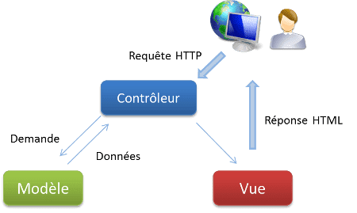

## Introduction

Pour créer un site Web sans passer par un CMS, nous avons plusieurs solutions.

1. Créer le site à partir de pages HTML statiques et ajouter du dynamisme avec CSS et JS
1. Utiliser un framework monolithique qui générera les pages html sur le serveur. C'est le cas de Symphony, Django.
1. Écrire deux serveurs. Un pour la partie back (c'est l'API rest), et un pour la partie front.
Pour la partie front nous retrouvons React, Vue, Angular.
Pour la partie back, nous verrons le serveur Spring.

Pour cela nous allons partir écrire ensemble un serveur REST qui utilise une base de données intégrée H2.
Pour faire le lien avec cette base, nous allons la déclarer dans le paramétrage et surtout utiliser l'ORM JPA/Hibernate.

## Les URL

Pour communiquer avec l'extérieur, nous nous appuyons sur le protocole HTTP.
Nous savons tous ce qu'est une URL, nous connaissons moins la notion de verbe, car le verbe n'est pas visible dans le navigateur.
Pour une API CRUD, nous utilisons quatre verbes : GET, POST, PUT, DELETE.  
GET est le verbe par défaut, celui de la lecture.
DELETE supprime la ressource.
POST crée la ressource.
PUT écrase la ressource, donc dans notre cas, la met à jour.

## L'API REST

Une API est une Interface de Programmation d'Application. C'est un terme générique.  
REST est un standard, un type d'architecture basé sur le protocole HTTP. En aucun cas c'est un protocole.  
REST utilise entre autre les URL et les verbes. Une ressource est identifiée par son URL.  
On va rechercher toutes les ressources ou une ressource avec son id.
On va créer une ressource, l'écraser ou la supprimer.  
Les informations sont dans :

* l'URL, qu'on appelle endpoint. On peut y stocker un id, ou le nom, la date d'un article.
* les paramètres, situés à la suite du endpoint et séparé par un point d'interrogation (?).
* le body. Ces informations ne sont pas visible. Le body est utilisé pour la création et la maj des informations.

L'API REST se base sur 6 grands principes :

1. Séparation entre client et serveur
1. Absence d’état de sessions (stateless)
1. Uniformité de l’interface
1. Mise en cache
1. Architecture en couches
1. Code à la demande

Pour écrire une bonne API, lisez l'article de [gekko](https://www.gekko.fr/les-bonnes-pratiques-a-suivre-pour-developper-des-apis-rest/), 
et conservez sous la main le petit [Quick Reference Card](https://blog.octo.com/wp-content/uploads/2014/12/OCTO-Refcard_API_Design_EN_3.0.pdf) d'Octo.

## Le MVC

### Pourquoi

Il fut un temps dans les années 2000, où l'on codait un site sans véritable règle.
Que ce soit des pages écrites en PHP, ou du JSP Java, tout était mélangé.
Le code HTML, les accès à la bases de données, les contrôles, la couche métier se côtoyaient dans le même fichier.
Ce genre de programmation avait un avantage : la rapidité d'écriture.  
Par contre, la maintenance, la compréhension et la sécurité n'étaient pas au rendez-vous.
Voici un exemple de code PHP écrit selon cette méthode :

```php
<div class="movies">
<?php
    // On passe en PHP en plein milieu du template...
    $args = array(
        'post_type' => 'post',
        'category_name' => 'films',
        'posts_per_page' => 3,
    );

    $my_query = new WP_Query( $args );

    if( $my_query->have_posts() ) : while( $my_query->have_posts() ) : $my_query->the_post();
    // Et on repasse dans le template...
?>
    <h2><?php the_title(); ?></h2>
    <div><?php the_content(); ?></div>
    <div><?php the_post_thumbnail(); ?></div>
<?php
    // Pour encore repasser en PHP...
    endwhile;
    endif;

    wp_reset_postdata();
?>
</div>
```

Et voici le même code structuré par du MVC.  
La vue sous la forme d'un template HTML :

```HTML



    <main class="content">
        <h1 class="blog__title">{{post.title}}</h1>
        {{post.content}}
    </main>
    <div class="movies">
    
        <h2>{{movie.title}}</h2>
        {{movie.content}}
    
    </div>

```

Et le contrôleur :

```PHP
<?php
// Récupération du contexte (données globales)
$context = Timber::get_context();

// Récupération de la publication à afficher (équivalent de la boucle)
$context['post'] = new TimberPost();

// Équivalent de la WP Query
$args = array(
      'post_type' => 'post',
    'category_name' => 'films',
    'posts_per_page' => 3,
);
$context['movies'] = Timber::get_posts( $args );

// Et enfin, on appelle le template
Timber::render( 'page.twig', $context );
```

### Le principe

La solution est de séparer les traitements dans des composants spécialisés.
Chaque composant prend une responsabilité et n'empiète pas sur la responsabilité des autres.
Le code est maintenable et donc évolutif.  
Nous avons 3 composants.



* Le modèle permet l'accès aux données du site.  
* Le contrôleur gère les interactions et la couche métier (traitements).  
* La vue est ce qui est envoyée aux client. Bien souvent c'est une page HTML.
